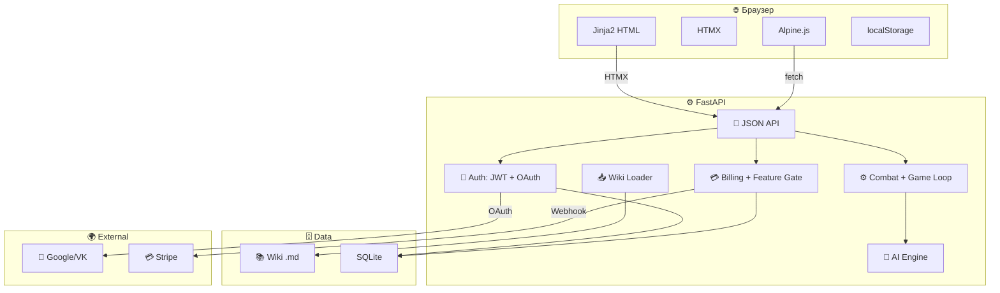

# Agent Rules — Warpsmith

Этот файл управляет поведением AI-агентов при работе над проектом.
Обновлён: 2026-05-01 (соответствует v0.2.0).

## Языки и стек

| Слой | Язык | Фреймворк |
|------|------|-----------|
| Backend | Python 3.12+ | FastAPI + Pydantic v2 |
| HTML-шаблоны | Jinja2 | Tailwind CSS (CDN) |
| Интерактив | JavaScript (ES6) | HTMX 2.x + Alpine.js 3.x |
| Карта | JavaScript (ES6) | Canvas API (vanilla) |
| База данных | SQL (SQLite 3) | sqlite3 (stdlib) |
| Симуляции | Python | NumPy 2.x (Monte Carlo) |
| Тесты | Python | pytest + pytest-cov |

**Зависимости:** fastapi, uvicorn, jinja2, numpy, python-multipart, python-jose[cryptography],
bcrypt, httpx, python-dotenv, pyyaml, python-frontmatter, pytest, pytest-cov

## Структура проекта

```
simulator/
├── main.py                   ← точка входа FastAPI
├── pyproject.toml            ← зависимости
├── ROADMAP.md                ← дорожная карта (7 фаз, ~75 фич)
├── AGENTS.md                 ← этот файл
├── INDEX.md                  ← полный индекс файлов со статусами
│
├── backend/
│   ├── auth/                 ← JWT, bcrypt, Cookie helpers
│   │   ├── __init__.py       ← User, create_jwt, hash_password, get_current_user
│   │   └── providers/        ← OAuth провайдеры
│   │       ├── base.py       ← OAuthProvider (ABC), PROVIDER_REGISTRY
│   │       ├── google.py     ← Google OAuth (OIDC)
│   │       ├── vk.py         ← VK OAuth (VK ID)
│   │       └── routes.py     ← /auth/{provider}/login, /callback, /providers
│   │
│   ├── billing/              ← Платежи и подписки
│   │   ├── plans.py          ← UserFeatures Feature Gate (Free/Premium)
│   │   ├── stripe_stub.py    ← Stripe заглушка для разработки
│   │   └── webhooks.py       ← /api/webhooks/stripe, /api/subscribe
│   │
│   ├── loader/               ← парсинг вики (.md → Python)
│   │   ├── registry.py       ← WikiRegistry (сканирование + кэш)
│   │   └── icon_map.py       ← ICON_MAP: 16 категорий, цвета, сортировка
│   │
│   ├── model/                ← Data models
│   │   └── unit.py           ← Unit, Weapon dataclasses
│   │
│   ├── engine/               ← Симуляция боя (Phase 1 — в разработке)
│   │   ├── dice.py           ← NumPy D6 pool
│   │   ├── combat.py         ← Hit → Wound → Save → Damage → FNP
│   │   ├── modifiers.py      ← ±1, Sustained, Lethal, Devastating, rerolls
│   │   └── scenario.py       ← Game Loop: Deployment → Round → End
│   │
│   ├── ai/                   ← AI-поведение
│   │   ├── decision.py       ← General AI Framework (greedy)
│   │   ├── ork_ai.py         ← Ork AI
│   │   └── tau_ai.py         ← T'au AI
│   │
│   ├── state/                ← Игровое состояние
│   │   ├── game_state.py     ← Позиции, раны, CP, VP
│   │   ├── map.py            ← 2D-карта (NumPy) + террейн + LoS
│   │   └── mission.py        ← Миссии, метки целей, условия победы
│   │
│   ├── db/                   ← SQLite persistence
│   │   ├── database.py       ← SQLite wrapper + migrate() (все таблицы)
│   │   └── models.py         ← (будущие) ORM-модели
│   │
│   └── reporter/             ← Вывод результатов
│       ├── table.py          ← Rich-таблицы в терминал
│       └── json_export.py    ← JSON-экспорт
│
├── web/
│   ├── routes/               ← FastAPI роуты
│   │   ├── pages.py          ← HTML: /, /team-builder, /scenario-setup, /pricing
│   │   ├── api.py            ← JSON: /api/units, /api/rosters, /api/simulate
│   │   └── auth.py           ← /register, /login, /logout, /api/me
│   │
│   ├── templates/            ← Jinja2-шаблоны
│   │   ├── base.html         ← Layout + auth header + upgrade banner + ad
│   │   ├── index.html        ← Главная
│   │   ├── team_builder.html ← Сбор армии
│   │   ├── scenario_setup.html
│   │   ├── round_viewer.html
│   │   ├── pricing.html      ← Free vs Premium
│   │   ├── auth/
│   │   │   ├── login.html
│   │   │   └── register.html
│   │   └── partials/         ← HTMX-фрагменты
│   │
│   └── static/
│       ├── team_builder.js   ← Alpine.js: ростер, PTS, save/load
│       └── icons/*.svg       ← 16 категорийных иконок
│
├── docs/
│   ├── architecture/
│   │   ├── C4.md             ← 4 уровня контейнеров (+Auth, Billing, OAuth)
│   │   └── ADR.md            ← 11 архитектурных решений
│   └── requirements/
│       ├── SRS.md            ← 7 разделов функциональных требований
│       └── UX.md             ← Дизайн: tooltips, beginner mode, synergy engine
│
└── tests/
    └── test_combat.py        ← (будущие) тесты движка
```

## Правила разработки

### 1. Код
- **Python:** PEP 8, строгие type hints (`def foo(bar: str) -> int:`)
- **FastAPI:** Pydantic v2 для валидации request/response
- **🚫 НИКАКОГО ХАРДКОДА где есть угроза масштабирования:**
  - Списки фракций, детачментов, стратагем — только из вики или API.
    Никогда не хардкодить в HTML или Python-словарях.
  - Если данные живут в вики (`.md` файлы) — читать оттуда.
    Единственное исключение — label для отображения (можно
    генерировать из id через `.replace("-", " ").title()`).
  - Новый функционал должен добавляться через контент (wiki),
    а не через изменение кода.
  - `web/templates/` — никаких хардкодных `<option>`, `<template x-if>`
    для списков. Только `x-for` с данными из `/api/*`.
- **SQLite:** raw SQL через `sqlite3` (stdlib)
- **JS:** ES6, без TypeScript

### 2. Тесты
- **pytest** для всех backend-компонентов
- Каждый модуль engine/ имеет отдельный test-файл
- `pytest tests/ --cov=backend/engine` — coverage > 80%
- Monte Carlo тесты: `numpy.random.seed(42)` для воспроизводимости

### 3. Данные
- **Единственный источник правды:** `wiki/` vault (YAML frontmatter + markdown)
- Wiki → читается через WikiRegistry при старте → in-memory кэш
- **Миграции БД:** raw SQL в `Database.migrate()` (CREATE TABLE IF NOT EXISTS)
- **Кэш:** pickle-файл Registry для быстрого старта

### 4. Git
- Репозиторий: `/mnt/d/Python/.git` (общий с другими проектами)
- Коммиты: `feat:`, `fix:`, `docs:`, `refactor:`, `test:`
- Ветки: `main`, `feat/<name>`, `fix/<name>`, `docs/<name>`
- Версионирование: ZeroVer `v0.<PHASE>.<PATCH>` (см. RELEASE.md)
- PR обязателен для всех изменений в main
- `.gitignore`: `__pycache__/`, `.env`, `*.db`, `wiki/`

### 5. Фронт
- **HTMX** — partial updates (hx-post, hx-get, hx-target)
- **Alpine.js** — реактивное состояние (x-data, x-model, x-init, x-if)
- **Tailwind** — через CDN, никаких билдов
- Карта — `<canvas>` с позиционированием

### 6. Добавление новой фракции
1. Создать `wiki/factions/<Name>.md` — описание фракции
2. Создать `wiki/units/<faction>/<Unit Name>.md` — каждый юнит
3. Создать `wiki/detachments/<faction>/<Detachment>.md` — каждый детачмент
4. Создать `wiki/stratagems/<faction>/<Stratagem>.md` — стратагемы
5. Создать `wiki/enhancements/<faction>/<Enhancement>.md` — энхансменты
6. Создать `backend/ai/<faction>_ai.py` — AI-приоритеты
7. **Код движка менять не нужно** — все данные читаются из WikiRegistry

## Архитектура (C4 Level 2)



## Запуск

```bash
cd /mnt/d/Python/Balthier/simulator
python main.py
# → http://127.0.0.1:8000
```

## Тестирование

```bash
python -m pytest tests/ -v
python -m pytest tests/ --cov=backend/engine  # coverage > 80%
```

## Роли и доступ (Authorization)

| Ресурс | Free | Premium | Guest |
|--------|------|---------|-------|
| Team Builder | ✅ 1 roster | ✅ unlimited | ✅ localStorage |
| Simulation | ✅ basic AI | ✅ full AI | ❌ |
| Export | ❌ | ✅ | ❌ |
| Public rosters | view only | create + view | view only |
| Ads | ✅ shown | ❌ hidden | ✅ shown |
| Priority | queue | instant | queue |
