# Developer Index — WH40k Battle Simulator

Центральный хаб проекта. Отсюда ведут все тропы.
Обновлён: 2026-05-01 | v0.2.0

## 📋 Граф документации

```mermaid
graph TD
    DEV["📌 DEV_INDEX.md<br/>← вы здесь"] --> ROAD["🛣️ ROADMAP.md<br/>дорожная карта"]
    DEV --> INDEX["📋 INDEX.md<br/>индекс файлов"]
    DEV --> AGENTS["🤖 AGENTS.md<br/>правила для AI-агентов"]
    DEV --> C4["🏗 C4.md<br/>архитектура (Mermaid)"]
    DEV --> ADR["⚖️ ADR.md<br/>архитектурные решения"]
    DEV --> SRS["📖 SRS.md<br/>системные требования"]
    DEV --> UX["🎨 UX.md<br/>дизайн интерфейса"]

    AGENTS --> HTTP["HTMX + Alpine.js"]
    AGENTS --> FASTAPI["FastAPI"]
    AGENTS --> NUMPY["NumPy Monte Carlo"]
    AGENTS --> UI["Jinja2 шаблоны"]

    ADR --> ADR1["ADR-001: Python + FastAPI"]
    ADR --> ADR2["ADR-002: HTMX + Alpine.js"]
    ADR --> ADR3["ADR-003: SQLite"]
    ADR --> ADR4["ADR-004: Wiki = источник правды"]
    ADR --> ADR5["ADR-005: Monte Carlo + Greedy AI"]
    ADR --> ADR6["ADR-006: Карта = NumPy 2D"]
    ADR --> ADR7["ADR-007: Game Loop = FSM"]
    ADR --> ADR8["ADR-008: JWT httponly cookie"]
    ADR --> ADR9["ADR-009: icon_map"]
    ADR --> ADR10["ADR-010: Free/Premium"]
    ADR --> ADR11["ADR-011: Social Login OAuth"]

    C4 --> C4L1["Уровень 1: Контекст (User, App, Wiki, Stripe, OAuth)"]
    C4 --> C4L2["Уровень 2: Auth, Billing, Feature Gate, Ad Injector"]
    C4 --> C4L3["Уровень 3: Компоненты (20+ блоков)"]
    C4 --> C4AUTH["Authorization + Tier Rules"]

    SRS --> FR1["FR-1: Team Builder"]
    SRS --> FR2["FR-2: Scenario Setup"]
    SRS --> FR3["FR-3: Simulation Run"]
    SRS --> FR4["FR-4: Game Engine"]
    SRS --> FR5["FR-5: User Profiles + OAuth"]
    SRS --> FR6["FR-6: Architecture"]
    SRS --> FR7["FR-7: Subscription & Billing"]
```



## 🔗 Быстрые ссылки

| # | Документ | Назначение |
|---|----------|------------|
| 1 | **DEV_INDEX.md** | 📌 Хаб всех документов (этот файл) |
| 2 | **INDEX.md** | 📋 Полный индекс всех файлов (75 код + 360 wiki) |
| 3 | **AGENTS.md** | 🤖 Правила разработки для AI-агентов |
| 4 | **ROADMAP.md** | 🛣️ Дорожная карта: 7 фаз, ~75 фич |
| 5 | **ROADMAP.html** | 📊 Визуализация roadmap в браузере |
| 6 | **docs/architecture/C4.md** | 🏗 C4-диаграммы (4 уровня) |
| 7 | **docs/architecture/ADR.md** | ⚖️ 11 архитектурных решений |
| 8 | **docs/requirements/SRS.md** | 📖 7 разделов требований |
| 9 | **docs/requirements/UX.md** | 🎨 UX-дизайн (tooltips, synergy engine) |
| 10 | **main.py** | 💻 Точка входа FastAPI |
| 11 | **pyproject.toml** | 📦 Зависимости проекта |

## 🏗 Проект

```
simulator/
├── AGENTS.md          правила разработки
├── DEV_INDEX.md       ← вы здесь
├── INDEX.md           индекс файлов
├── ROADMAP.md         дорожная карта
├── main.py            FastAPI
├── pyproject.toml     зависимости
│
├── backend/
│   ├── auth/          JWT + bcrypt + OAuth (Google, VK)
│   ├── billing/       Stripe, Feature Gate, Free/Premium
│   ├── loader/        Wiki парсер, ICON_MAP
│   ├── model/         Unit, Weapon dataclasses
│   ├── engine/        Combat, Dice, Modifiers (Phase 1)
│   ├── ai/            AI-поведение
│   ├── state/         Game State, Map
│   ├── db/            SQLite
│   └── reporter/      Rich-таблицы
│
├── web/
│   ├── routes/        pages, api, auth
│   ├── templates/     Jinja2 (auth/, partials/)
│   └── static/        JS, SVG icons (16)
│
├── docs/
│   ├── architecture/  C4.md, ADR.md
│   └── requirements/  SRS.md, UX.md
│
└── wiki/ → /mnt/d/Python/Balthier/wiki   360+ страниц данных
```

## 🧩 Типовые сценарии

| Сценарий | Что читать | Что трогать |
|----------|-----------|-------------|
| Добавить юнита | AGENTS.md → п.6 | `wiki/units/<faction>/<Name>.md` |
| Добавить стратагему | AGENTS.md → п.6 | `wiki/stratagems/<faction>/<Name>.md` |
| Добавить AI-поведение | C4 → Уровень 3 (AI) | `backend/ai/<faction>_ai.py` |
| Добавить OAuth-провайдера | ADR-011 | `backend/auth/providers/<name>.py` |
| Изменить Feature Gate | ADR-010 | `backend/billing/plans.py` |
| Добавить страницу | ADR-002 (HTMX) | `web/templates/` + `web/routes/pages.py` |
| Поправить БД | ADR-003, SRS.md | `backend/db/database.py` + `main.py: db.migrate()` |
| Написать тест | AGENTS.md → п.2 | `tests/test_*.py` |

## 🚀 Запуск

```bash
cd /mnt/d/Python/Balthier/simulator
python main.py
# → http://127.0.0.1:8000

# Тесты
python -m pytest tests/ -v
```

## ⚙️ API (curl)

```bash
curl http://127.0.0.1:8000/api/health
# → {"status": "ok", "version": "0.2.0"}

curl http://127.0.0.1:8000/api/me
# → {"id": 1, "email": "...", "display_name": "..."}

curl http://127.0.0.1:8000/api/units/orks
# → список юнитов орков (заглушка)
```
