# Developer Index — Warpsmith

Центральный хаб проекта. Отсюда ведут все тропы.
Обновлён: 2026-05-09 | v0.7.7

**Навигация:** [INDEX.md](/mnt/d/Python/Balthier/INDEX.md) ← · → [WIKI_INDEX.md](/mnt/d/Python/Balthier/simulator/wiki/WIKI_INDEX.md) · → [Features Index](docs/features/Features_index.md)

## 📋 Граф документации

```mermaid
graph TD
    DEV["📌 DEV_INDEX.md<br/>← вы здесь"] --> ROAD["🛣️ ROADMAP.md<br/>дорожная карта"]
    DEV --> AGENTS["🤖 AGENTS.md<br/>правила для AI-агентов"]
    DEV --> FEAT["📝 Features Index<br/>62 feature specs"]
    DEV --> C4["🏗 C4.md<br/>архитектура (Mermaid)"]
    DEV --> ADR["⚖️ ADR.md<br/>11 архитектурных решений"]
    DEV --> SRS["📖 SRS.md<br/>системные требования"]
    DEV --> UX["🎨 UX.md<br/>дизайн интерфейса"]
    DEV --> DEPLOY["☁️ deployment.md<br/>деплой (Railway/Dokku/self)"]

    AGENTS --> HTTP["HTMX + Alpine.js"]
    AGENTS --> FASTAPI["FastAPI"]
    AGENTS --> NUMPY["NumPy Monte Carlo"]
    AGENTS --> UI["Jinja2 шаблоны"]
    AGENTS --> WIKI["Wiki-driven — YAML frontmatter"]

    FEAT --> F1["Phase 1: Combat (100%)"]
    FEAT --> F2["Phase 2: Game System (93%)"]
    FEAT --> F3["Phase 3: AI (78%)"]
    FEAT --> F4["Phase 4: UI (100%)"]
    FEAT --> F5["Phase 5: Production (100%)"]

    C4 --> C4L1["Уровень 1: Контекст"]
    C4 --> C4L2["Уровень 2: Auth, Billing, Feature Gate"]
    C4 --> C4L3["Уровень 3: Компоненты"]

    ADR --> ADR1["ADR-001: Python + FastAPI"]
    ADR --> ADR2["ADR-002: HTMX + Alpine.js"]
    ADR --> ADR3["ADR-003: SQLite"]
    ADR --> ADR4["ADR-004: Wiki = источник правды"]
    ADR --> ADR5["ADR-005: Monte Carlo + Greedy AI"]
    ADR --> ADR6["ADR-006: Карта = NumPy 2D"]
    ADR --> ADR7["ADR-007: Game Loop = FSM"]
    ADR --> ADR8["ADR-008: JWT httponly cookie"]
    ADR --> ADR9["ADR-009: icon_map"]
    ADR --> ADR10["ADR-010: Free/Premium"]
    ADR --> ADR11["ADR-011: Social Login OAuth"]
```



## 🔗 Быстрые ссылки

| # | Документ | Назначение |
|---|----------|------------|
| 1 | **DEV_INDEX.md** | 📌 Хаб всех документов (этот файл) |
| 2 | **AGENTS.md** | 🤖 Правила разработки для AI-агентов |
| 3 | **ROADMAP.md** | 🛣️ Дорожная карта: 7 фаз, 82 фичи |
| 4 | **ROADMAP.html** | 🖥️ Визуальная дорожная карта |
| 5 | **CHANGELOG.md** | 📜 История изменений (Keep a Changelog) |
| 6 | **RELEASE.md** | 📦 Политика релизов (ZeroVer, GitHub Flow) |
| 7 | **docs/architecture/C4.md** | 🏗 C4-диаграммы (4 уровня) |
| 8 | **docs/architecture/ADR.md** | ⚖️ 11 архитектурных решений |
| 9 | **docs/requirements/SRS.md** | 📖 7 разделов требований |
| 10 | **docs/requirements/UX.md** | 🎨 UX-дизайн |
| 11 | **docs/requirements/code-review-plan.md** | 🔎 План полной проверки кода: 25 atomic review tasks; index: `docs/requirements/code-review/code-review.md` |
| 12 | **docs/api/endpoints.md** | 🌐 One-page API endpoint index; Swagger remains canonical |
| 13 | **docs/deployment.md** | ☁️ Деплой: Railway, Dokku, self-host |
| 14 | **docs/features/Features_index.md** | 📝 Индекс feature-спек (62 specs; roadmap 82+ фич) |
| 15 | **main.py** | 💻 Точка входа FastAPI |
| 16 | **pyproject.toml** | 📦 Зависимости + ruff + mypy + pytest |

## 🏗 Проект

```
simulator/
├── AGENTS.md              правила разработки
├── DEV_INDEX.md           ← вы здесь
├── ROADMAP.md             дорожная карта
├── ROADMAP.html           визуальная дорожная карта
├── RELEASE.md             политика релизов
├── CHANGELOG.md           история изменений
├── main.py                FastAPI (create_app)
├── pyproject.toml         зависимости + конфиг ruff/mypy/pytest
├── Dockerfile             production-образ
├── Procfile               Railway process
│
├── backend/
│   ├── auth/              JWT + bcrypt + OAuth (Google, VK)
│   ├── billing/           Stripe, Feature Gate, Free/Premium
│   ├── loader/            Wiki парсер + registry (160 загружаемых units, 23 detachments)
│   │   └── icon_map.py    SVG иконки (18 категорий)
│   ├── model/             Unit, Weapon dataclasses
│   ├── engine/
│   │   ├── combat.py      Combat Sequence: Hit→Wound→Save→FNP
│   │   ├── dice.py        Dice Pool (NumPy Monte Carlo)
│   │   ├── modifiers.py   ±1, Sustained, Lethal, Devastating, keywords
│   │   ├── scenario.py    Game Loop (5 фаз: Command→Movement→Shooting→Charge→Fight)
│   │   ├── replay.py      ReplayRecorder + SQLite persistence
│   │   └── ai/
│   │       ├── decision.py    Greedy decision engine (F3.1)
│   │       ├── deployment.py  Zone placement AI (F3.4)
│   │       ├── faction_ai.py  Wiki-driven FactionAIProfile (F3.2)
│   │       └── autoplay.py    AI vs AI full scenario (F3.5)
│   ├── state/             GameState, BattlefieldMap, Mission, Roster
│   ├── db/                SQLite (users, rosters, replays)
│   ├── security/          CORS + CSP headers
│   └── logging_setup.py   structlog + Sentry
│
├── web/
│   ├── routes/
│   │   ├── api.py                core: /units, /simulate, /map, /health, /factions
│   │   ├── api_detachments.py    /detachments
│   │   ├── api_rosters.py        /rosters, /generate, /synergies (единственный owner roster CRUD)
│   │   ├── api_replays.py        /auto-play, /replays, /results
│   │   ├── auth.py               /register, /login, /logout, /api/me
│   │   └── pages.py              HTML: /, /team-builder, /scenario-setup, ...
│   ├── templates/         Jinja2 (base, team_builder, scenario_setup, auth, pricing, ...)
│   │   └── partials/      battlefield_map, detachment_picker, synergy_panel, unit_card
│   └── static/            JS (Alpine; battlefield_map, scenario_setup), SVG icons (18)
│
├── tests/                 41 файл, 454 теста
│
├── docs/
│   ├── architecture/      C4.md, ADR.md
│   ├── requirements/      SRS.md, UX.md
│   ├── features/          62 specs (F1.1–F6.7 + F2.18 terrain requirement)
│   ├── api/               endpoints.md — one-page API endpoint index
│   └── deployment.md
│
└── wiki/                  480 .md — данные в репозитории (monorepo)
    ├── factions/          orks, tau, adeptus-mechanicus
    ├── units/             даташиты юнитов
    ├── detachments/       правила детачментов
    └── stratagems/        стратагемы
```

## 🧩 Типовые сценарии

| Сценарий | Что читать | Что трогать |
|----------|-----------|-------------|
| Добавить юнита | AGENTS.md → wiki-driven | `wiki/units/<faction>/<Name>.md` |
| Добавить детачмент | AGENTS.md → wiki-driven | `wiki/detachments/<faction>/<Name>.md` |
| Править Warlord/ростеры | F4.12 + C4 | `web/static/team_builder.js`, `web/routes/api_rosters.py` |
| Править генератор оппонента | F4.9 + tests | `web/routes/api_rosters.py`, `web/static/scenario_setup.js` |
| Добавить стратагему | AGENTS.md → wiki-driven | `wiki/stratagems/<faction>/<Name>.md` |
| Добавить AI-поведение | ADR-005, C4 → AI | `backend/engine/ai/decision.py` |
| Добавить OAuth-провайдера | ADR-011 | `backend/auth/providers/<name>.py` |
| Изменить Feature Gate | ADR-010 | `backend/billing/plans.py` |
| Добавить страницу | ADR-002 (HTMX) | `web/templates/` + `web/routes/pages.py` |
| Поправить БД | ADR-003, SRS.md | `backend/db/database.py` |
| Править terrain / cover / LoS | F2.13 → F2.18 + raw Terrain | `backend/state/map.py`, `backend/state/line_of_sight.py`, `backend/engine/combat.py` |
| Написать тест | AGENTS.md | `tests/test_*.py` |
| Создать/проверить эндпоинт API | C4.md → docs/api/endpoints.md → Swagger | `web/routes/api.py` (core) или `api_rosters.py`/`api_replays.py`/`api_detachments.py` |

## 🚀 Запуск

```bash
cd /mnt/d/Python/Balthier/simulator
python3 -c "import uvicorn; uvicorn.run('main:app', host='127.0.0.1', port=8000, reload=False)"
# → http://127.0.0.1:8000

# Тесты (454 шт.)
uv run python -m pytest tests/ -q
```

## ⚙️ API (curl)

```bash
curl http://127.0.0.1:8000/api/health
# → {"status": "ok", "version": "0.7.7"}

curl http://127.0.0.1:8000/api/factions
# → {"factions": [3 factions]}

curl 'http://127.0.0.1:8000/api/units?faction=orks'
# → [81 units]

curl http://127.0.0.1:8000/api/detachments?faction=orks
# → [10 detachments with rules]

curl http://127.0.0.1:8000/api/units/Boyz/detail
# → full datasheet with weapons, wargear, icons

curl http://127.0.0.1:8000/api/map/tiles
# → {"width": 44, "height": 44, "tiles": [...], "deploy_zones": {...}}
```

## 📊 Текущий прогресс

| Фаза | Статус | Ключевое |
|------|--------|----------|
| Phase 0: Foundation | ✅ 100% | FastAPI, Auth, Wiki, Icons, Billing |
| Phase 1: Combat Engine | ✅ 100% | Monte Carlo, 13 keywords, /api/simulate |
| Phase 2: Game System | ✅ 100% | Game Loop, Map, LoS, Cover, Roster CRUD |
| Phase 3: AI & Automation | 🔧 78% | Greedy AI, Faction Profiles, Autoplay, Replay, Viewer |
| Phase 4: Web UI Polish | ✅ 100% | Faction browser, Unit modal, Detachments, Synergy, Map, Movement, My Rosters, Replays |
| Phase 5: Production | ✅ 100% | Docker, Railway, Rate limit, CORS, structlog, CI/CD, Backup |
| Phase 6: Monetization | ⏳ 0% | Stripe, Ads, Premium Trial |
| Phase 7: Expansion | ⏳ 0% | Import/Export, i18n, Campaigns |
