# Developer Index — Warpsmith

Центральный хаб проекта. Отсюда ведут все тропы.
Обновлён: 2026-05-04 | v0.6.0

**Навигация:** [INDEX.md](/mnt/d/Python/Balthier/INDEX.md) ← · → [WIKI_INDEX.md](/mnt/d/Python/Balthier/wiki/WIKI_INDEX.md) · → [Features Index](docs/features/Features_index.md)

## 📋 Граф документации

```mermaid
graph TD
    DEV["📌 DEV_INDEX.md<br/>← вы здесь"] --> ROAD["🛣️ ROADMAP.md<br/>дорожная карта"]
    DEV --> INDEX["📋 INDEX.md<br/>индекс файлов"]
    DEV --> AGENTS["🤖 AGENTS.md<br/>правила для AI-агентов"]
    DEV --> FEAT["📝 Features Index<br/>50+ feature specs"]
    DEV --> C4["🏗 C4.md<br/>архитектура (Mermaid)"]
    DEV --> ADR["⚖️ ADR.md<br/>11 архитектурных решений"]
    DEV --> SRS["📖 SRS.md<br/>системные требования"]
    DEV --> UX["🎨 UX.md<br/>дизайн интерфейса"]
    DEV --> DEPLOY["☁️ deployment.md<br/>деплой (Dokku/Railway/self)"]

    AGENTS --> HTTP["HTMX + Alpine.js"]
    AGENTS --> FASTAPI["FastAPI"]
    AGENTS --> NUMPY["NumPy Monte Carlo"]
    AGENTS --> UI["Jinja2 шаблоны"]
    AGENTS --> WIKI["Wiki-driven — YAML frontmatter"]

    FEAT --> F3["Phase 3: AI (29%)"]
    FEAT --> F4["Phase 4: UI (100%)"]
    FEAT --> F5["Phase 5: Production (29%)"]

    C4 --> C4L1["Уровень 1: Контекст"]
    C4 --> C4L2["Уровень 2: Auth, Billing, Feature Gate"]
    C4 --> C4L3["Уровень 3: Компоненты (20+ блоков)"]

    ADR --> ADR1["ADR-001: Python + FastAPI"]
    ADR --> ADR2["ADR-002: HTMX + Alpine.js"]
    ADR --> ADR3["ADR-003: SQLite"]
    ADR --> ADR4["ADR-004: Wiki = источник правды"]
    ADR --> ADR5["ADR-005: Monte Carlo + Greedy AI"]
    ADR --> ADR6["ADR-006: Карта = NumPy 2D"]
    ADR --> ADR7["ADR-007: Game Loop = FSM"]
    ADR --> ADR8["ADR-008: JWT httponly cookie"]
    ADR --> ADR9["ADR-009: icon_map"]
    ADR --> ADR10["ADR-010: Free/Premium"]
    ADR --> ADR11["ADR-011: Social Login OAuth"]

    SRS --> FR1["FR-1: Team Builder"]
    SRS --> FR2["FR-2: Scenario Setup"]
    SRS --> FR3["FR-3: Simulation Run"]
    SRS --> FR4["FR-4: Game Engine"]
    SRS --> FR5["FR-5: User Profiles + OAuth"]
    SRS --> FR6["FR-6: Architecture"]
    SRS --> FR7["FR-7: Subscription & Billing"]
```



## 🔗 Быстрые ссылки

| # | Документ | Назначение |
|---|----------|------------|
| 1 | **DEV_INDEX.md** | 📌 Хаб всех документов (этот файл) |
| 2 | **/mnt/d/Python/Balthier/wiki/WIKI_INDEX.md** | 📋 Индекс всех вики-данных (481 файлов) |
| 3 | **AGENTS.md** | 🤖 Правила разработки для AI-агентов |
| 4 | **ROADMAP.md** | 🛣️ Дорожная карта: 7 фаз |
| 5 | **CHANGELOG.md** | 📜 История изменений |
| 6 | **docs/architecture/C4.md** | 🏗 C4-диаграммы (4 уровня) |
| 7 | **docs/architecture/ADR.md** | ⚖️ 11 архитектурных решений |
| 8 | **docs/requirements/SRS.md** | 📖 7 разделов требований |
| 9 | **docs/requirements/UX.md** | 🎨 UX-дизайн |
| 10 | **docs/deployment.md** | ☁️ Деплой: Dokku, Railway, self-host |
| 11 | **docs/features/Features_index.md** | 📝 Индекс всех 50 feature specs |
| 12 | **main.py** | 💻 Точка входа FastAPI |
| 13 | **pyproject.toml** | 📦 Зависимости + ruff + mypy |
| 14 | **RELEASE.md** | 📦 Политика релизов (ZeroVer, GitHub Flow) |

## 🏗 Проект

```
simulator/
├── AGENTS.md          правила разработки
├── DEV_INDEX.md       ← вы здесь
├── INDEX.md           индекс файлов
├── ROADMAP.md         дорожная карта
├── RELEASE.md         политика релизов
├── CHANGELOG.md       история изменений
├── main.py            FastAPI (create_app)
├── pyproject.toml     зависимости
├── Procfile           Railway/Dokku web process
├── app.json           Dokku metadata
│
├── backend/
│   ├── auth/          JWT + bcrypt + OAuth (Google, VK)
│   ├── billing/       Stripe, Feature Gate, Free/Premium
│   ├── loader/        Wiki парсер + registry (160+ units)
│   │   └── icon_map.py    SVG иконки (18 категорий)
│   ├── model/         Unit, Weapon dataclasses
│   ├── engine/
│   │   ├── combat/    Combat Sequence: Hit→Wound→Save→FNP
│   │   ├── dice/      Dice Pool (NumPy Monte Carlo)
│   │   ├── game/      Game State, Map, LoS, Missions, Roster
│   │   └── ai/        AI decision engine + deployment AI
│   ├── db/            SQLite (users, rosters, scenarios, replays)
│   └── reporter/      Rich-таблицы
│
├── web/
│   ├── routes/        pages.py, api.py, auth.py
│   ├── templates/     Jinja2 (base, team_builder, scenario_setup, auth, pricing)
│   │   └── partials/  detachment_picker, synergy_panel, canvas_map
│   └── static/        JS (Alpine), SVG icons (19)
│
├── deploy/            dokku-setup.sh, railway.json, systemd.service
│
├── tests/             27 файлов, ~300 тестов
│
├── docs/
│   ├── architecture/  C4.md, ADR.md
│   ├── requirements/  SRS.md, UX.md
│   ├── features/      50 specs (F1.1–F5.7)
│   └── deployment.md
│
└── wiki/ → /mnt/d/Python/Balthier/wiki   ~481 страниц данных
```

## 🧩 Типовые сценарии

| Сценарий | Что читать | Что трогать |
|----------|-----------|-------------|
| Добавить юнита | AGENTS.md → wiki-driven | `wiki/units/<faction>/<Name>.md` |
| Добавить детачмент | AGENTS.md → wiki-driven | `wiki/detachments/<faction>/<Name>.md` |
| Добавить стратагему | AGENTS.md → wiki-driven | `wiki/stratagems/<faction>/<Name>.md` |
| Добавить AI-поведение | ADR-005, C4 → AI | `backend/engine/ai/decision.py` |
| Добавить OAuth-провайдера | ADR-011 | `backend/auth/providers/<name>.py` |
| Изменить Feature Gate | ADR-010 | `backend/billing/plans.py` |
| Добавить страницу | ADR-002 (HTMX) | `web/templates/` + `web/routes/pages.py` |
| Поправить БД | ADR-003, SRS.md | `backend/db/database.py` |
| Написать тест | AGENTS.md | `tests/test_*.py` |
| Создать эндпоинт API | — | `web/routes/api.py` + Pydantic модель |

## 🚀 Запуск

```bash
cd /mnt/d/Python/Balthier/simulator
python main.py
# → http://127.0.0.1:8000

# Тесты (~300 шт.)
python -m pytest tests/ -q
```

## ⚙️ API (curl)

```bash
curl http://127.0.0.1:8000/api/health
# → {"status": "ok", "version": "0.6.0"}

curl http://127.0.0.1:8000/api/factions
# → {"factions": [...3 factions]}

curl 'http://127.0.0.1:8000/api/units?faction=orks'
# → {"faction": "orks", "units": [81 юнит]}

curl http://127.0.0.1:8000/api/detachments?faction=orks
# → [10 детачментов с правилами]

curl http://127.0.0.1:8000/api/simulate -X POST \
  -H 'Content-Type: application/json' \
  -d '{"attacker_faction":"orks","attacker_unit":"Boyz",\
       "defender_faction":"tau","defender_unit":"Strike Team",\
       "weapon_name":"Shoota","n_iterations":1000}'
# → {"weapon":"Shoota","stats":{"mean":0.264,...}}
```

## 📊 Текущий прогресс

| Фаза | Статус | Ключевое |
|------|--------|----------|
| Phase 0: Foundation | ✅ 100% | FastAPI, Auth, Wiki, Icons, Billing |
| Phase 1: Combat Engine | ✅ 100% | Monte Carlo, Combat Sequence, /api/simulate |
| Phase 2: Game System | ✅ 100% | Game State, Map, LoS, Missions, Roster CRUD |
| Phase 3: AI & Automation | 🟢 29% | Greedy AI, Deployment AI |
| Phase 4: Web UI Polish | ✅ 100% | Faction browser, Unit modal, Detachment picker, Synergy hints, Canvas map, SVG icons, Progressive Disclosure, Stat tooltips |
| Phase 5: Production | 🟢 29% | Docker, Deployment docs (Dokku/Railway/self-host) |
| Phase 6: Monetization | ⏳ 0% | Stripe, Ads |
| Phase 7: Expansion | ⏳ 0% | i18n, Campaigns |
