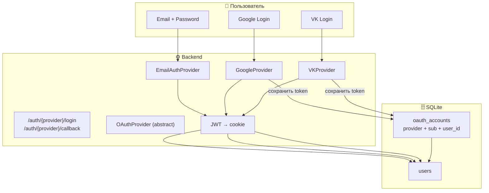
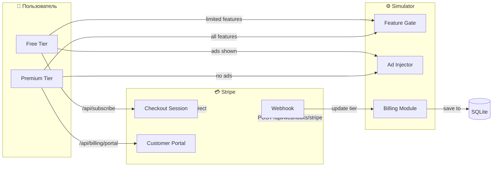

# Architecture Decision Records (ADR)

## ADR-001: Python + FastAPI

**Статус:** Принято
**Дата:** 2026-04-30

**Контекст:** Нужен язык и фреймворк для веб-приложения с парсингом markdown, симуляцией, AI и HTML-рендерингом.

**Решение:** Python 3.12+ с FastAPI.

**Последствия:**
- Автоматическая документация через /docs (OpenAPI)
- Асинхронные роуты для потенциально долгих симуляций
- Dependency injection (Depends) для JWT-middleware, WikiLoader

---

## ADR-002: HTMX + Alpine.js (фронт)

**Статус:** Принято

**Контекст:** Нужен интерактивный UI с карточками юнитов, live-PTS, модалками, tooltips.

**Решение:** HTMX для partial updates, Alpine.js для реактивного состояния. Без React/Vue.

**Последствия:**
- Нет сборки JS — меньше зависимостей
- Alpine.js `x-data`, `x-init`, `x-if` — достаточно для модалок, фильтров, live-PTS
- HTMX `hx-post`, `hx-target` — для сохранения/загрузки ростера без перезагрузки

---

## ADR-003: SQLite (persistence)

**Статус:** Принято

**Контекст:** Нужно сохранять ростера, сценарии, реплеи, пользователей. Проект локальный, без облака.

**Решение:** SQLite, одна `simulator.db` в корне проекта.

**Последствия:**
- Нет сервера БД — упрощает деплой
- Миграции — встроенные CREATE TABLE IF NOT EXISTS
- Таблицы: `users`, `rosters`, `replays`
- Будущее: PostgreSQL при необходимости multi-user

---

## ADR-004: Вики как источник правды для юнитов

**Статус:** Принято

**Контекст:** Юниты, детачменты, правила 9ed/10ed описаны в Obsidian-вики. Нужно избежать дублирования данных.

**Решение:** Markdown-вики с YAML frontmatter — единственный источник данных. WikiLoader парсит `.md` файлы при старте.

**Последствия:**
- Любое изменение в вики → автоматически в симулятор
- YAML frontmatter содержит: faction, type, tags, pts, stats, weapons, abilities
- При 100+ страницах — pickle-кэш для быстрого старта

---

## ADR-005: Monte Carlo + Greedy AI

**Статус:** Принято

**Контекст:** N/A

---

## ADR-006: Карта — NumPy 2D-array

**Статус:** Принято

---

## ADR-007: Game Loop — конечный автомат

**Статус:** Принято

---

## ADR-008: JWT через httponly cookie (Auth)

**Статус:** Принято
**Дата:** 2026-05-01

**Контекст:** Нужна регистрация, вход, защита API, персональные ростера и история симуляций. Приложение будет разворачиваться на хостинге, доступно через интернет любому пользователю.

**Требования:**
1. На входе пользователь авторизуется → получает доступ к функциям
2. Если нет аккаунта → регистрация
3. После регистрации/входа → JWT в httponly Secure SameSite=Lax cookie
4. Без токена → только просмотр публичных ростереров (гостевой режим)

**Решение:** JWT-токен в httponly cookie, bcrypt для паролей, CORS для хостинга.

**Обоснование:**
- **bcrypt** (не SHA-256) — соль включена в hash, защита от rainbow tables
- **httponly + Secure + SameSite=Lax** — XSS-защита, CSRF-защита, не работает без HTTPS
- **7-дневный токен** — достаточно для пользователя, без refresh для MVP
- **CORS** — разрешённые origin'ы через ALLOWED_ORIGINS env

### Поток пользователя

```
[Главная] → кнопки Login / Register
    │
    ├── Register → форма (email + password + display_name)
    │   └── валидация email + password ≥ 6 → bcrypt → redirect /team-builder
    │
    ├── Login → форма (email + password)
    │   └── проверка bcrypt → JWT → Set-Cookie → redirect /team-builder
    │
    └── Logout → delete_cookie → redirect /
```

### Middleware

```python
async def get_current_user(request: Request) -> User:
    """Читает JWT из cookie (веб) или Authorization header (API)."""
    token = request.cookies.get("token")
    if not token:
        auth = request.headers.get("Authorization", "")
        if auth.startswith("Bearer "):
            token = auth[7:]
    if not token:
        raise HTTPException(401, "Authentication required")
    payload = decode_jwt(token)
    if payload is None:
        raise HTTPException(401, "Invalid or expired token")
    user = get_user_by_id(payload["user_id"])
    if user is None:
        raise HTTPException(401, "User not found")
    return user
```

### Схема БД

```sql
CREATE TABLE users (
    id           INTEGER PRIMARY KEY AUTOINCREMENT,
    email        TEXT NOT NULL UNIQUE,
    password_hash TEXT NOT NULL,
    display_name TEXT DEFAULT '',
    created_at   TIMESTAMP DEFAULT CURRENT_TIMESTAMP,
    last_login   TIMESTAMP
);
```

### Перенос ростера под пользователя

```sql
ALTER TABLE rosters ADD COLUMN user_id INTEGER REFERENCES users(id) DEFAULT 1;
ALTER TABLE rosters ADD COLUMN is_public BOOLEAN DEFAULT 0;
```

### UI

В хедере Alpine.js проверяет `GET /api/me`:

```
┌─────────────────────────────────────────────────────────────────┐
│  ⚔️ WH40k Sim  [Team Builder]  [Scenario]      Login  Register │
└─────────────────────────────────────────────────────────────────┘
```

После входа:
```
┌─────────────────────────────────────────────────────────────────┐
│  ⚔️ WH40k Sim  [Team Builder]  [Scenario]      Balthier [Logout]│
└─────────────────────────────────────────────────────────────────┘
```

### Production-конфигурация

```bash
# .env
HOSTING=true
JWT_SECRET=<сгенерировать через openssl rand -hex 64>
ALLOWED_ORIGINS=https://your-domain.com
HOST=0.0.0.0
PORT=8000
DB_PATH=/data/simulator.db
```

Запуск:
```bash
python main.py
# → uvicorn запускается на 0.0.0.0:8000, CORS на ALLOWED_ORIGINS
```

```html
<template x-if="user">
  <span x-text="user.display_name"></span>
  <a href="/auth/logout">Logout</a>
</template>
<template x-if="!user">
  <a href="/auth/login">Login</a>
  <a href="/auth/register">Register</a>
</template>
```

### Правила авторизации (Authorization)

| Ресурс | Авторизованный | Гость (user_id=1) | Условие |
|--------|---------------|-------------------|---------|
| POST /api/rosters | ✅ создать | ✅ создать (localStorage) | JWT → user_id |
| GET /api/rosters | ✅ свои | ✅ публичные | `WHERE user_id = $id OR is_public = 1` |
| GET /api/rosters/{id} | ✅ свой | ✅ публичный | проверка user_id / is_public |
| DELETE /api/rosters/{id} | ✅ только свой | ❌ запрещено | `user_id == current_user.id` |
| POST /api/simulate | ✅ | ❌ | только авторизованный |
| GET /api/replays | ✅ свои | ❌ | по user_id |
| GET /api/me | ✅ | ❌ (401) | decode JWT |
| GET /auth/login | ✅ | ✅ | без проверки |
| GET /auth/register | ✅ | ✅ | без проверки |

**Правила:**
1. Всегда проверяется `user_id` из JWT — манипуляции с user_id в запросе игнорируются
2. Гость (без JWT) работает только с localStorage → публикация создаёт запись с user_id=1
3. DELETE и запуск симуляции — только для авторизованных
4. `is_public` позволяет шарить ростера без логина

---

## ADR-009: Таблица icon_map — отдельный модуль

**Статус:** Принято
**Дата:** 2026-05-01

**Контекст:** Каждый тип юнита отображается SVG-иконкой. Нужны единые цвета, подписи, порядок сортировки и иконки с правильным viewBox.

**Решение:** Модуль `backend/loader/icon_map.py` содержит словарь `ICON_MAP`, 16 категорий.

**Последствия:** Новая категория → новый .svg + строка в ICON_MAP. Сортировка в Team Builder по `sort_order`.

---

## ADR-011: Social Login (OAuth 2.0 / OpenID Connect)

**Статус:** Принято
**Дата:** 2026-05-01

**Контекст:** Нужна поддержка входа через сторонние сервисы (Google, VK и др.) в дополнение к email+password. Архитектура должна позволять подключать новых провайдеров без изменения ядра.

### Требования

1. Вход через Google, VK (и future: Yandex, Discord, GitHub)
2. Привязка нескольких провайдеров к одному аккаунту
3. Создание аккаунта при первом входе через соцсеть
4. Сосуществование с email+password (один и тот же email можно подключить)
5. Никаких внешних SDK на старте — реализуем OAuth через HTTP-запросы

### Решение: Provider Interface + единая таблица oauth_accounts



### Provider Interface

```python
from abc import ABC, abstractmethod
from dataclasses import dataclass

@dataclass
class OAuthUserInfo:
    sub: str          # Уникальный ID провайдера (Google sub, VK id)
    email: str
    display_name: str
    avatar_url: str = ""

class OAuthProvider(ABC):
    """Абстрактный OAuth-провайдер. Все провайдеры следуют этому интерфейсу."""

    @property
    @abstractmethod
    def name(self) -> str:
        """Уникальное имя провайдера: 'google', 'vk'"""
        ...

    @abstractmethod
    def get_authorize_url(self, redirect_uri: str, state: str) -> str:
        """Вернуть URL для редиректа пользователя на OAuth-сервер."""
        ...

    @abstractmethod
    async def exchange_code(self, code: str, redirect_uri: str) -> dict:
        """Обменять authorization code на access_token + user info."""
        ...

    @abstractmethod
    async def get_user_info(self, access_token: str) -> OAuthUserInfo:
        """Получить профиль пользователя по access_token."""
        ...
```

### Схема БД — oauth_accounts

```sql
CREATE TABLE IF NOT EXISTS oauth_accounts (
    id              INTEGER PRIMARY KEY AUTOINCREMENT,
    user_id         INTEGER NOT NULL REFERENCES users(id),
    provider        TEXT NOT NULL,         -- 'google', 'vk'
    provider_user_id TEXT NOT NULL,        -- sub из Google, id из VK
    access_token    TEXT,
    refresh_token   TEXT,
    token_expires_at TIMESTAMP,
    created_at      TIMESTAMP DEFAULT CURRENT_TIMESTAMP,
    UNIQUE(provider, provider_user_id)
);
CREATE INDEX IF NOT EXISTS idx_oauth_user ON oauth_accounts(user_id);
```

### Поток входа через Google (пример)

```
1. GET /auth/google/login
   → редирект на https://accounts.google.com/o/oauth2/v2/auth
     ?client_id=...&redirect_uri=/auth/google/callback
     &response_type=code&scope=email+profile&state=<random>

2. Пользователь подтверждает → Google редиректит на
   /auth/google/callback?code=<auth_code>&state=<state>

3. POST https://oauth2.googleapis.com/token
   → code + client_id + client_secret + redirect_uri
   → получаем { access_token, refresh_token, expires_in }

4. GET https://openidconnect.googleapis.com/v1/userinfo
   Authorization: Bearer <access_token>
   → получаем { sub, email, name, picture }

5. Ищем oauth_accounts WHERE provider='google' AND provider_user_id=<sub>
   → Если найден: логиним этого user_id
   → Если не найден:
     a. Ищем users WHERE email=<email>
     b. Если есть — привязываем (link accounts)
     c. Если нет — создаём нового user

6. Выдаём JWT → Set-Cookie → редирект на /
```

---

## ADR-010: Subscription Model (Free / Premium)

**Статус:** Принято
**Дата:** 2026-05-01

**Контекст:** Коммерциализация проекта. Нужно разделить пользователей на бесплатных (с рекламой) и платных (по подписке).

### Требования

| Аспект | Free | Premium ($5-10/мес) |
|--------|------|---------------------|
| Реклама | ✅ показывается | ❌ без рекламы |
| Сохранённые ростера | 1 шт | без лимита |
| Симуляция | базовый AI | полный AI |
| Экспорт (CSV/JSON) | ❌ | ✅ |
| Публичные ростера | ❌ создавать, ✅ смотреть | ✅ |
| Приоритет симуляции | очередь | мгновенно |
| Новые функции | после задержки | сразу |

### Решение

1. **Payment Provider:** Stripe (Lemon Squeezy как альтернатива)
2. **Webhook:** Stripe Webhook → обновление `subscription_tier` в БД
3. **Feature Gate:** централизованный `UserFeatures` класс, один источник правды
4. **Реклама:** серверная вставка через шаблоны + Alpine.js скрытие для Premium
5. **Tier check:** FastAPI `Depends(require_tier("premium"))`

### Схема потоков



### Feature Gate — архитектура

```python
class UserFeatures:
    """Единый источник правды — какие функции доступны пользователю."""

    FREE = {
        "max_rosters": 3,
        "simulation_ai": "basic",
        "export_enabled": False,
        "public_rosters": False,     # может только смотреть
        "ads_enabled": True,
        "priority_simulation": False,
    }

    PREMIUM = {
        "max_rosters": 999,
        "simulation_ai": "full",
        "export_enabled": True,
        "public_rosters": True,      # может создавать и смотреть
        "ads_enabled": False,
        "priority_simulation": True,
    }

    @classmethod
    def for_user(cls, user) -> dict:
        tier = getattr(user, "tier", "free")
        return cls.FREE if tier == "free" else cls.PREMIUM
```

### Stripe Webhook

```python
@router.post("/api/webhooks/stripe")
async def stripe_webhook(request: Request):
    payload = await request.body()
    sig_header = request.headers.get("stripe-signature")
    event = stripe.Webhook.construct_event(payload, sig_header, WEBHOOK_SECRET)

    if event["type"] == "checkout.session.completed":
        session = event["data"]["object"]
        user_id = session["client_reference_id"]
        subscription_id = session["subscription"]
        # Обновить subscription_tier = "premium" + subscription_id
        # Установить subscription_expires_at = +1 месяц

    elif event["type"] == "customer.subscription.deleted":
        subscription_id = event["data"]["object"]["id"]
        # Вернуть tier = "free"

    return {"status": "ok"}
```

### Схема БД

```sql
-- К existing users:
ALTER TABLE users ADD COLUMN tier TEXT DEFAULT 'free';
ALTER TABLE users ADD COLUMN subscription_id TEXT DEFAULT '';
ALTER TABLE users ADD COLUMN subscription_expires_at TIMESTAMP;

-- Новые таблицы:
CREATE TABLE IF NOT EXISTS subscriptions (
    id              INTEGER PRIMARY KEY AUTOINCREMENT,
    user_id         INTEGER NOT NULL REFERENCES users(id),
    stripe_sub_id   TEXT NOT NULL,
    stripe_cust_id  TEXT,
    tier            TEXT NOT NULL DEFAULT 'premium',
    status          TEXT NOT NULL DEFAULT 'active',  -- active, past_due, canceled
    started_at      TIMESTAMP DEFAULT CURRENT_TIMESTAMP,
    expires_at      TIMESTAMP,
    canceled_at     TIMESTAMP
);

CREATE TABLE IF NOT EXISTS payments (
    id              INTEGER PRIMARY KEY AUTOINCREMENT,
    user_id         INTEGER REFERENCES users(id),
    subscription_id INTEGER REFERENCES subscriptions(id),
    stripe_pi_id    TEXT,            -- Payment Intent ID
    amount          INTEGER,          -- в центах
    currency        TEXT DEFAULT 'usd',
    status          TEXT,             -- succeeded, failed, refunded
    created_at      TIMESTAMP DEFAULT CURRENT_TIMESTAMP
);
```

### UI — Upgrade Banner

```html
<!-- Всплывающий баннер для Free-пользователей -->
<template x-if="user && user.features.ads_enabled">
  <div class="bg-gradient-to-r from-yellow-900 to-yellow-700 p-4 text-center">
    ⚡ Upgrade to Premium — no ads, unlimited rosters, priority AI
    <a href="/subscribe" class="btn ml-4">🔥 Upgrade Now</a>
  </div>
</template>

<!-- Рекламный блок (заглушка) -->
<template x-if="user && user.features.ads_enabled">
  <div class="ad-block bg-gray-800 border border-gray-700 p-4 my-4 text-center text-sm text-gray-500">
    [ Ad Space — пока заглушка ]
  </div>
</template>
```

### Последствия

- Stripe SDK не обязателен на старте: заглушка `backend/billing/stripe_stub.py`
- Feature Gate вызывается в каждом Depends → кэшировать в `request.state.user_features`
- Все ограничения (1 ростер, реклама) проверяются и на сервере (API), и на клиенте (Alpine.js)
- Счётчики рекламы для аналитики — через `/api/ads/impression`
