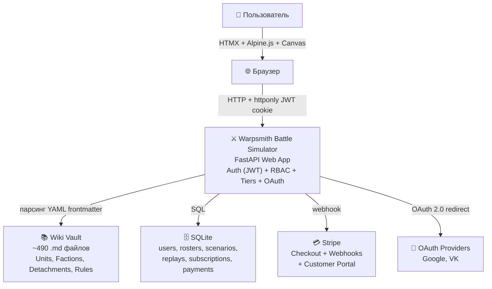
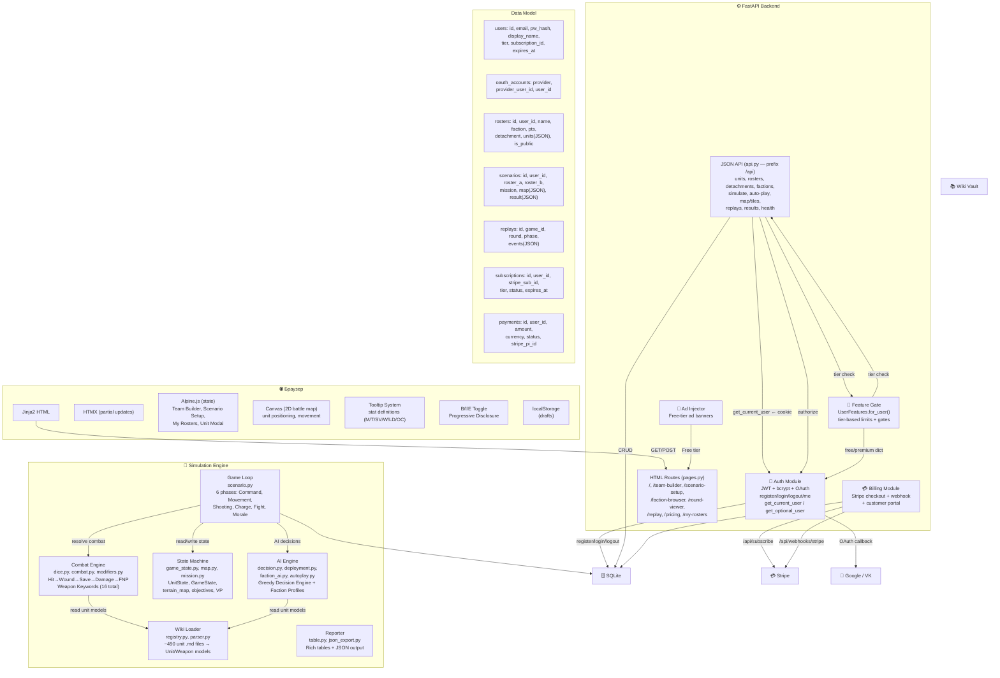
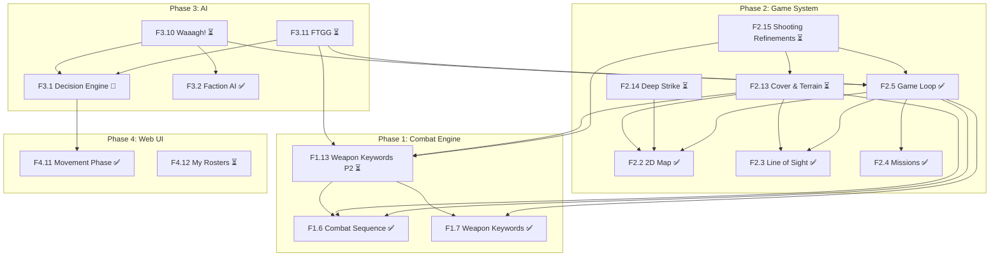

# Architecture (C4)

Симулятор сценариев Warhammer 40k — веб-приложение с FastAPI-бекендом, HTMX/Alpine-фронтом и JWT-авторизацией.

**Обновлён:** 2026-05-06 — добавлены F1.13 (Weapon Keywords Phase 2), F2.13–F2.15 (Cover, Deep Strike, Shooting), F3.10–F3.11 (Waaagh!, FTGG), F4.12 (My Rosters).

## Уровень 1 — Контекст



## Уровень 2 — Контейнеры



## Уровень 3 — Компоненты

```mermaid
graph TB
    subgraph Auth["🔐 Auth"]
        REG["POST /auth/register"]
        LOGIN["POST /auth/login"]
        LOGOUT["GET /auth/logout"]
        ME["GET /auth/me<br/>GET /api/me (alias)"]
        JWT_MW["get_current_user<br/>(cookie → JWT)"]
        SHA["bcrypt hasher"]
        AUTHZ["Authorization Rules<br/>— user_id → свои записи<br/>— is_public → все<br/>— guest → user_id=1"]
        OAUTH_LOGIN["GET /auth/{provider}/login"]
        OAUTH_CB["GET /auth/{provider}/callback"]
        GOOG_P["GoogleProvider (OIDC)"]
        VK_P["VKProvider (OAuth 2.0)"]
    end

    subgraph Web["Web UI"]
        TB["Team Builder<br/>faction picker, unit modal,<br/>squad size, wargear, save/load"]
        SS["Scenario Setup<br/>roster picker, Generate AI Opponent,<br/>map preview, Start Simulation"]
        RV["Round Viewer<br/>round-by-round replay,<br/>event log, VP tracker"]
        MR["My Rosters (F4.12)<br/>list, delete, edit, duplicate"]
        FB["Faction Browser<br/>filter by category/PTS"]
        PR["Pricing<br/>Free vs Premium plans"]
    end

    subgraph API["API (/api)"]
        R_UNIT["GET /units<br/>GET /units/browse<br/>GET /units/{name}/detail"]
        R_SIM["POST /simulate<br/>POST /simulate-unit"]
        R_ROST["POST /rosters (create)<br/>GET /rosters (list)<br/>GET /rosters/{id} (detail)<br/>PUT /rosters/{id} (update)<br/>DELETE /rosters/{id}<br/>POST /rosters/{id}/duplicate<br/>POST /rosters/generate<br/>POST /rosters/synergies"]
        R_DET["GET /detachments<br/>GET /detachments/{name}"]
        R_MAP["GET /map/tiles"]
        R_AP["POST /auto-play"]
        R_REP["GET /replays<br/>GET /replays/{game_id}"]
        R_RES["GET /results/{game_id}"]
        R_FAC["GET /factions"]
        R_HLTH["GET /health"]
    end

    subgraph Engine["🎲 Simulation Engine"]
        WL["Wiki Loader<br/>registry.py → WikiRegistry<br/>parser.py → parse_unit()<br/>icon_map.py → category icons"]
        DICE["dice.py<br/>NumPy D6 Monte Carlo<br/>DiceExpr: (count, type, mod)"]
        MOD["modifiers.py<br/>±1 caps, rerolls,<br/>Blast, Heavy, Torrent,<br/>Melta, Lance, Rapid Fire,<br/>Sustained, Lethal, Devastating"]
        CMBT["combat.py<br/>Hit→Wound→Save→Damage→FNP<br/>Cover (+1 SV)<br/>Ignores Cover, Indirect Fire<br/>BGNT, Look Out Sir, Pistol"]
        SCEN["scenario.py<br/>Game Loop: Command → Move →<br/>Shoot → Charge → Fight → Morale<br/>Deep Strike deployment (Round 2+)<br/>Waaagh! activation (Orks)<br/>FTGG Spotter/Guided (Tau)"]
        STATE["game_state.py<br/>UnitState, GameState<br/>move_unit(), deal_damage()"]
        MAP["map.py<br/>terrain_map (NumPy),<br/>deploy zones, objectives"]
        MISS["mission.py<br/>MissionConfig, VP scoring,<br/>end-game conditions"]
        AI_DEC["decision.py (F3.1)<br/>choose_action(),<br/>score_shoot/charge/move<br/>objective-based movement"]
        AI_DEP["deployment.py (F3.4)<br/>zone placement,<br/>Deep Strike positioning"]
        AI_FAC["faction_ai.py (F3.2)<br/>Waaagh! timing,<br/>FTGG pair selection"]
        AP["autoplay.py (F3.5)<br/>AI vs AI full scenario<br/>→ replay in SQLite"]
    end

    subgraph DB["SQLite"]
        USERS_T["users"]
        ROST_T["rosters<br/>user_id + is_public"]
        SCEN_T["scenarios"]
        REPL_T["replays<br/>by game_id"]
        SUBS_T["subscriptions"]
        PAY_T["payments"]
        OAUTH_T2["oauth_accounts"]
    end

    subgraph Billing["💳 Billing"]
        SUB["POST /api/subscribe"]
        WH["POST /api/webhooks/stripe"]
        PORTAL["GET /api/billing/portal"]
        PLANS["Plans Config<br/>free / premium"]
    end

    subgraph Features["🎯 Feature Gate"]
        FG["UserFeatures.for_user()"]
        REQ_TIER["require_tier('premium')"]
    end

    subgraph Ads["📢 Ad Injector"]
        AD_INJECT["Ad placeholder<br/>base.html / pages"]
        AD_VIEW["POST /api/ads/impression"]
    end

    %% Auth flows
    REG --> SHA --> USERS_T
    LOGIN --> SHA --> JWT_MW
    JWT_MW --> AUTHZ
    JWT_MW --> ME
    ME --> USERS_T

    %% API authorization
    AUTHZ --> R_ROST
    AUTHZ --> R_SIM
    AUTHZ --> R_UNIT
    AUTHZ --> R_DET
    AUTHZ --> R_FAC

    %% Roster CRUD
    TB --> R_ROST --> AUTHZ
    TB --> FG
    R_ROST --> ROST_T
    MR --> R_ROST

    %% Simulation pipeline
    SS --> R_AP
    R_AP --> AP
    AP --> SCEN
    SCEN --> STATE
    SCEN --> CMBT
    SCEN --> AI_DEC
    SCEN --> AI_FAC
    SCEN --> AI_DEP
    CMBT --> MOD
    CMBT --> DICE
    STATE --> MAP
    STATE --> MISS
    AP --> REPL_T
    R_AP --> SCEN_T

    %% Replay
    RV --> R_REP --> REPL_T
    RV --> R_RES --> SCEN_T

    %% Billing
    SUB --> STRIPE_EXT["💳 Stripe Checkout"]
    STRIPE_EXT --> WH
    WH --> SUBS_T
    WH --> USERS_T
    PORTAL --> STRIPE_CP["💳 Stripe Portal"]
    PLANS --> FG
    FG --> REQ_TIER

    %% OAuth
    OAUTH_LOGIN --> GOOG["🔑 Google OAuth"]
    OAUTH_LOGIN --> VK["🔑 VK OAuth"]
    GOOG --> OAUTH_CB
    VK --> OAUTH_CB
    OAUTH_CB --> USERS_T
    OAUTH_CB --> OAUTH_T2
    OAUTH_CB --> JWT_MW
```



## Структура проекта (актуальная)

```
simulator/
├── main.py                          ← точка входа FastAPI
├── AGENTS.md                        ← правила для AI-агентов
├── DEV_INDEX.md                     ← хаб разработчика
├── ROADMAP.md                       ← дорожная карта (7 фаз)
│
├── wiki/                            ← ~490 .md — данные (monorepo)
│   ├── units/{faction}/*.md          ← юниты (YAML frontmatter + markdown)
│   ├── factions/*.md                 ← описания фракций
│   ├── detachments/{faction}/*.md    ← детачменты
│   ├── rules/10th/*.md               ← правила 10-й редакции (23 файла)
│   └── WIKI_INDEX.md
│
├── backend/
│   ├── auth/                         ← JWT, bcrypt, Cookie helpers
│   │   ├── __init__.py               ← User, create_jwt, hash_password
│   │   └── providers/                ← OAuth провайдеры
│   │       ├── base.py               ← OAuthProvider (ABC), PROVIDER_REGISTRY
│   │       ├── google.py             ← Google OAuth (OIDC)
│   │       ├── vk.py                 ← VK OAuth (VK ID)
│   │       └── routes.py             ← /auth/{provider}/login, /callback, /providers
│   │
│   ├── billing/                      ← Платежи и подписки
│   │   ├── plans.py                  ← UserFeatures Feature Gate (Free/Premium)
│   │   ├── stripe_stub.py            ← Stripe заглушка
│   │   └── webhooks.py               ← /api/webhooks/stripe, /api/subscribe
│   │
│   ├── loader/                       ← парсинг wiki (.md → Python)
│   │   ├── registry.py               ← WikiRegistry (сканирование + кэш)
│   │   ├── icon_map.py               ← ICON_MAP: категории, цвета, SVG
│   │   └── parser.py                 ← parse_unit() — YAML frontmatter → Unit
│   │
│   ├── model/                        ← Data models
│   │   └── unit.py                   ← Unit, Weapon dataclasses
│   │
│   ├── engine/                       ← Симуляция боя
│   │   ├── dice.py                   ← NumPy D6 pool (Monte Carlo)
│   │   ├── combat.py                 ← Hit→Wound→Save→Damage→FNP
│   │   ├── modifiers.py              ← Weapon Keywords (16 total)
│   │   ├── scenario.py               ← Game Loop (6 фаз)
│   │   └── ai/                       ← AI-поведение
│   │       ├── decision.py           ← Greedy Decision Engine (F3.1)
│   │       ├── deployment.py         ← Zone placement AI (F3.4)
│   │       ├── faction_ai.py         ← Wiki-driven FactionAIProfile (F3.2)
│   │       └── autoplay.py           ← AI vs AI full scenario (F3.5)
│   │
│   ├── state/                        ← Игровое состояние
│   │   ├── game_state.py             ← UnitState, GameState, move_unit()
│   │   ├── map.py                    ← 2D-карта (NumPy) + террейн
│   │   └── mission.py               ← Миссии, objectives, VP
│   │
│   ├── db/                           ← SQLite persistence
│   │   └── database.py               ← SQLite wrapper + migrate()
│   │
│   └── reporter/                     ← Вывод результатов
│       ├── table.py                  ← Rich-таблицы в терминал
│       └── json_export.py            ← JSON-экспорт
│
├── web/
│   ├── routes/                       ← FastAPI роуты
│   │   ├── pages.py                  ← HTML: /, /team-builder, /scenario-setup,
│   │   │                                 /faction-browser, /pricing, /my-rosters,
│   │   │                                 /round-viewer, /replay, /result
│   │   ├── api.py                    ← JSON API (prefix /api):
│   │   │                                 units, rosters, detachments, factions,
│   │   │                                 simulate, auto-play, map/tiles,
│   │   │                                 replays, results, health
│   │   └── auth.py                   ← /auth/register, /login, /logout, /auth/me,
│   │                                     /api/me (alias)
│   │
│   ├── templates/                    ← Jinja2-шаблоны
│   │   ├── base.html                 ← Layout + auth header + B/I/E toggle
│   │   ├── team_builder.html         ← Сбор армии (модалка, статы, оружие)
│   │   ├── scenario_setup.html       ← Выбор миссии + Generate Opponent
│   │   ├── faction_browser.html      ← Просмотр юнитов по фракциям
│   │   ├── round_viewer.html         ← Пошаговый реплей
│   │   ├── pricing.html              ← Free vs Premium
│   │   ├── my_rosters.html           ← Управление ростерами (F4.12)
│   │   ├── auth/
│   │   │   ├── login.html
│   │   │   └── register.html
│   │   └── partials/                 ← HTMX-фрагменты
│   │       ├── detachment_picker.html
│   │       ├── synergy_panel.html
│   │       ├── canvas_map.html
│   │       ├── tooltip_definitions.html
│   │       └── unit_card.html
│   │
│   └── static/
│       ├── team_builder.js           ← Alpine.js: ростер, PTS, save
│       ├── scenario_setup.js         ← Generate Opponent, Start Simulation
│       ├── my_rosters.js             ← CRUD ростера (F4.12)
│       ├── unit_modal.js             ← UnitModal mixin
│       ├── synergy_hints.js          ← SynergyHints controller
│       ├── detachment_picker.js      ← DetachmentPicker controller
│       ├── canvas_map.js             ← CanvasMap controller
│       ├── progressive_disclosure.js ← B/I/E mode toggle
│       ├── tooltips.js               ← STAT_TOOLTIPS + tooltipManager
│       ├── unit_card.css             ← Стили карточек юнитов
│       └── icons/*.svg               ← 18 категорийных иконок
│
├── docs/
│   ├── architecture/
│   │   ├── C4.md                     ← этот документ
│   │   └── ADR.md                    ← 11 архитектурных решений
│   └── features/
│       ├── Features_index.md         ← указатель на все feature-спеки
│       ├── f1.*.md                   ← Phase 1: Combat Engine (13 фич)
│       ├── f2.*.md                   ← Phase 2: Game System (15 фич)
│       ├── f3.*.md                   ← Phase 3: AI & Automation (9 фич)
│       ├── f4.*.md                   ← Phase 4: Web UI Polish (11 фич)
│       ├── f5.*.md                   ← Phase 5: Production (7 фич)
│       └── f6.*.md                   ← Phase 6: Monetization (7 фич)
│
└── tests/                            ← ~30 файлов, ~340 тестов
    ├── test_combat.py
    ├── test_faction_ai.py
    ├── test_ai_decision.py
    ├── test_weapon_keywords.py
    └── ...
```

## Feature Spec → Module Mapping

| Feature | Status | Module(s) |
|---------|--------|-----------|
| F1.6 Combat Sequence | ✅ | `backend/engine/combat.py`, `dice.py` |
| F1.7 Weapon Keywords (Sust/Lethal/Dev) | ✅ | `backend/engine/modifiers.py` |
| **F1.13 Weapon Keywords Phase 2** | ⏳ | `backend/engine/modifiers.py`, `combat.py` |
| F2.2 2D Map | ✅ | `backend/state/map.py` |
| F2.3 Line of Sight | ✅ | `backend/state/map.py`, `scenario.py` |
| F2.4 Missions | ✅ | `backend/state/mission.py` |
| F2.5 Game Loop | ✅ | `backend/engine/scenario.py` |
| **F2.13 Cover & Terrain** | ⏳ | `backend/engine/combat.py`, `state/map.py` |
| **F2.14 Deep Strike** | ⏳ | `backend/engine/scenario.py`, `ai/deployment.py` |
| **F2.15 Shooting Refinements** | ⏳ | `backend/engine/scenario.py`, `ai/decision.py` |
| F3.1 Greedy Decision Engine | 🔧 | `backend/engine/ai/decision.py` |
| F3.2 Faction AI Profiles | ✅ | `backend/engine/ai/faction_ai.py` |
| **F3.10 Waaagh! (Orks)** | ⏳ | `backend/engine/scenario.py`, `ai/faction_ai.py` |
| **F3.11 FTGG + Markerlight (Tau)** | ⏳ | `backend/engine/scenario.py`, `ai/faction_ai.py` |
| F4.9 Generate Random Opponent | ✅ | `web/routes/api.py`, `web/static/scenario_setup.js` |
| F4.11 Movement Phase (10ed) | ✅ | `backend/engine/scenario.py` |
| **F4.12 My Rosters** | ⏳ | `web/routes/pages.py`, `web/static/my_rosters.js` |

## Dependency Graph (Feature Specs)



## API Route Map

| Method | Path | Module | Auth | Feature |
|--------|------|--------|------|---------|
| GET | `/` | pages.py | No | Index |
| GET | `/team-builder` | pages.py | No | Team Builder |
| GET | `/faction-browser` | pages.py | No | Faction Browser |
| GET | `/scenario-setup` | pages.py | Optional | Scenario Setup |
| GET | `/my-rosters` | pages.py | Yes | My Rosters (F4.12) |
| GET | `/round-viewer/{id}` | pages.py | No | Round Viewer |
| GET | `/replay/{id}` | pages.py | No | Replay |
| GET | `/result/{id}` | pages.py | No | Result Screen |
| GET | `/pricing` | pages.py | No | Pricing |
| GET | `/pmf-chart` | pages.py | No | PMF Chart |
| GET | `/account/billing` | pages.py | Yes | Billing |
| GET | `/auth/login` | auth.py | No | Login Page |
| POST | `/auth/login` | auth.py | No | Login |
| GET | `/auth/register` | auth.py | No | Register Page |
| POST | `/auth/register` | auth.py | No | Register |
| GET | `/auth/logout` | auth.py | Yes | Logout |
| GET | `/auth/me` | auth.py | Optional | Current User |
| GET | `/api/me` | auth.py | Optional | Me (alias) |
| GET | `/auth/{provider}/login` | providers/routes.py | No | OAuth Login |
| GET | `/auth/{provider}/callback` | providers/routes.py | No | OAuth Callback |
| GET | `/auth/providers` | providers/routes.py | No | List Providers |
| GET | `/api/health` | api.py | No | Health Check |
| GET | `/api/units` | api.py | No | List Units |
| GET | `/api/units/browse` | api.py | No | Browse Units |
| GET | `/api/units/{name}/detail` | api.py | No | Unit Detail |
| POST | `/api/simulate` | api.py | No | Simulate Attack |
| POST | `/api/simulate-unit` | api.py | No | Simulate Unit Attack |
| GET | `/api/detachments` | api.py | No | List Detachments |
| GET | `/api/detachments/{name}` | api.py | No | Detachment Detail |
| GET | `/api/map/tiles` | api.py | No | Map Tiles |
| GET | `/api/factions` | api.py | No | List Factions |
| POST | `/api/auto-play` | api.py | No | AI vs AI Battle |
| GET | `/api/rosters` | api.py | Yes | List User Rosters |
| POST | `/api/rosters` | api.py | Yes | Create Roster |
| GET | `/api/rosters/{id}` | api.py | Yes | Get Roster |
| PUT | `/api/rosters/{id}` | api.py | Yes | Update Roster (F4.12) |
| DELETE | `/api/rosters/{id}` | api.py | Yes | Delete Roster |
| POST | `/api/rosters/{id}/duplicate` | api.py | Yes | Duplicate Roster (F4.12) |
| POST | `/api/rosters/generate` | api.py | No | Generate AI Roster |
| POST | `/api/rosters/synergies` | api.py | No | Synergy Check |
| GET | `/api/replays` | api.py | No | List Replays |
| GET | `/api/replays/{game_id}` | api.py | No | Get Replay |
| GET | `/api/results/{game_id}` | api.py | No | Get Result |
| POST | `/api/subscribe` | billing/webhooks.py | Yes | Stripe Checkout |
| POST | `/api/webhooks/stripe` | billing/webhooks.py | No | Stripe Webhook |
| GET | `/api/subscribe/success` | billing/webhooks.py | Yes | Success Page |
| GET | `/api/billing/portal` | billing/webhooks.py | Yes | Stripe Portal |

## Правила авторизации

### Базовая (Across tiers)

| Операция | Условие доступа | Проверка |
|----------|----------------|----------|
| POST /api/rosters | Авторизованный пользователь | JWT → user_id |
| GET /api/rosters | Только свои | `WHERE user_id = current_user.id` |
| GET /api/rosters (публичные) | Любой | `WHERE is_public = 1` |
| PUT /api/rosters/{id} | Только автор | `user_id == current_user.id` |
| DELETE /api/rosters/{id} | Только автор | `user_id == current_user.id` |
| POST /api/rosters/{id}/duplicate | Авторизованный | JWT → новый user_id |
| POST /api/auto-play | Любой авторизованный | user_id → scenarios |

### Tier-based

| Функция | Free | Premium | Проверка |
|---------|------|---------|----------|
| Max rosters | 1 | без лимита | `UserFeatures.for_user(user).max_rosters` |
| Simulation AI | basic | full | `require_tier("premium")` |
| Export CSV/JSON | ❌ | ✅ | `require_tier("premium")` |
| Ads | показывать | скрыть | `user.features.ads_enabled` |

## БД (актуальная схема)

```sql
CREATE TABLE users (
    id              INTEGER PRIMARY KEY AUTOINCREMENT,
    email           TEXT NOT NULL UNIQUE,
    password_hash   TEXT NOT NULL,
    display_name    TEXT DEFAULT '',
    tier            TEXT DEFAULT 'free',
    subscription_id INTEGER,
    expires_at      TIMESTAMP,
    created_at      TIMESTAMP DEFAULT CURRENT_TIMESTAMP,
    last_login      TIMESTAMP
);

CREATE TABLE rosters (
    id          INTEGER PRIMARY KEY AUTOINCREMENT,
    user_id     INTEGER NOT NULL REFERENCES users(id),
    name        TEXT NOT NULL,
    faction     TEXT NOT NULL,
    pts_limit   INTEGER DEFAULT 2000,
    detachment  TEXT,
    units       TEXT NOT NULL,       -- JSON array
    is_public   BOOLEAN DEFAULT 0,
    created_at  TIMESTAMP DEFAULT CURRENT_TIMESTAMP,
    updated_at  TIMESTAMP DEFAULT CURRENT_TIMESTAMP
);

CREATE TABLE replays (
    game_id     TEXT PRIMARY KEY,    -- "auto_42" format
    scenario    TEXT,                 -- JSON: full scenario state
    events      TEXT,                 -- JSON array of round events
    created_at  TIMESTAMP DEFAULT CURRENT_TIMESTAMP
);

CREATE TABLE oauth_accounts (
    id                INTEGER PRIMARY KEY AUTOINCREMENT,
    user_id           INTEGER NOT NULL REFERENCES users(id),
    provider          TEXT NOT NULL,
    provider_user_id  TEXT NOT NULL,
    access_token      TEXT,
    refresh_token     TEXT,
    token_expires_at  TIMESTAMP,
    created_at        TIMESTAMP DEFAULT CURRENT_TIMESTAMP,
    UNIQUE(provider, provider_user_id)
);

CREATE TABLE subscriptions (
    id              INTEGER PRIMARY KEY AUTOINCREMENT,
    user_id         INTEGER NOT NULL REFERENCES users(id),
    stripe_sub_id   TEXT NOT NULL,
    stripe_cust_id  TEXT,
    tier            TEXT NOT NULL DEFAULT 'premium',
    status          TEXT NOT NULL DEFAULT 'active',
    started_at      TIMESTAMP DEFAULT CURRENT_TIMESTAMP,
    expires_at      TIMESTAMP,
    canceled_at     TIMESTAMP
);

CREATE TABLE payments (
    id              INTEGER PRIMARY KEY AUTOINCREMENT,
    user_id         INTEGER REFERENCES users(id),
    subscription_id INTEGER REFERENCES subscriptions(id),
    stripe_pi_id    TEXT,
    amount          INTEGER,       -- cents
    currency        TEXT DEFAULT 'usd',
    status          TEXT,
    created_at      TIMESTAMP DEFAULT CURRENT_TIMESTAMP
);
```
