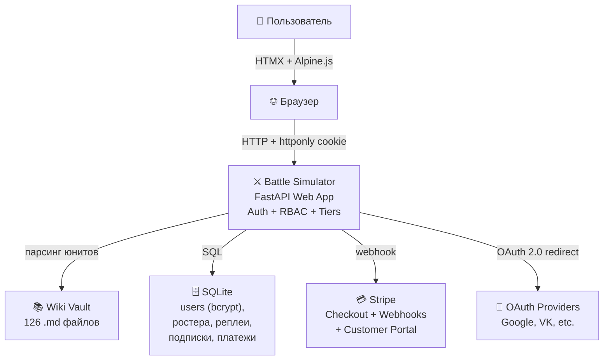
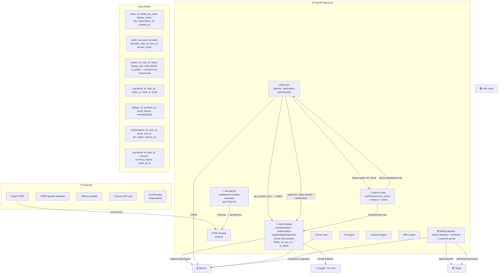
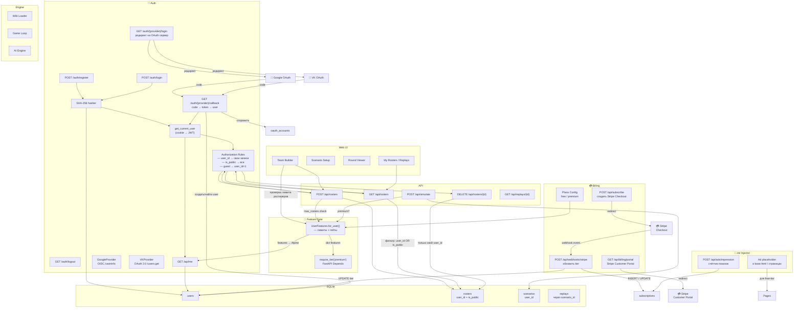

# Architecture (C4)

Симулятор сценариев Warhammer 40k — веб-приложение с FastAPI-бекендом, HTMX/Alpine-фронтом и JWT-авторизацией.

## Уровень 1 — Контекст



## Уровень 2 — Контейнеры



## Уровень 3 — Компоненты



## Структура проекта (web/)

```
web/
├── routes/
│   ├── __init__.py
│   ├── auth.py         ← /register, /login, /logout
│   ├── pages.py        ← HTML-страницы
│   └── api.py          ← JSON API (+ JWT middleware)
├── templates/
│   ├── base.html
│   ├── auth/
│   │   ├── login.html
│   │   └── register.html
│   └── ...
├── static/
│   ├── team_builder.js
│   └── icons/*.svg
```

## Схема БД

```sql
CREATE TABLE users (
    id           INTEGER PRIMARY KEY AUTOINCREMENT,
    email        TEXT NOT NULL UNIQUE,
    password_hash TEXT NOT NULL,
    display_name TEXT DEFAULT '',
    created_at   TIMESTAMP DEFAULT CURRENT_TIMESTAMP,
    last_login   TIMESTAMP
);

CREATE TABLE rosters (
    id          INTEGER PRIMARY KEY AUTOINCREMENT,
    user_id     INTEGER DEFAULT 1 REFERENCES users(id),
    name        TEXT NOT NULL,
    faction     TEXT NOT NULL,
    pts_limit   INTEGER DEFAULT 2000,
    detachment  TEXT,
    units       TEXT NOT NULL,   -- JSON
    is_public   BOOLEAN DEFAULT 0,
    created_at  TIMESTAMP DEFAULT CURRENT_TIMESTAMP,
    updated_at  TIMESTAMP DEFAULT CURRENT_TIMESTAMP
);

CREATE TABLE scenarios (
    id          INTEGER PRIMARY KEY AUTOINCREMENT,
    user_id     INTEGER REFERENCES users(id),
    roster_a_id INTEGER REFERENCES rosters(id),
    roster_b_id INTEGER REFERENCES rosters(id),
    mission     TEXT,
    map         TEXT,             -- JSON (map config)
    result      TEXT,             -- JSON (final score)
    created_at  TIMESTAMP DEFAULT CURRENT_TIMESTAMP
);

CREATE TABLE replays (
    id          INTEGER PRIMARY KEY AUTOINCREMENT,
    scenario_id INTEGER REFERENCES scenarios(id),
    round       INTEGER,
    phase       TEXT,
    events      TEXT NOT NULL,    -- JSON array
    created_at  TIMESTAMP DEFAULT CURRENT_TIMESTAMP
);

CREATE TABLE IF NOT EXISTS oauth_accounts (
    id              INTEGER PRIMARY KEY AUTOINCREMENT,
    user_id         INTEGER NOT NULL REFERENCES users(id),
    provider        TEXT NOT NULL,
    provider_user_id TEXT NOT NULL,
    access_token    TEXT,
    refresh_token   TEXT,
    token_expires_at TIMESTAMP,
    created_at      TIMESTAMP DEFAULT CURRENT_TIMESTAMP,
    UNIQUE(provider, provider_user_id)
);

CREATE TABLE IF NOT EXISTS subscriptions (
    id              INTEGER PRIMARY KEY AUTOINCREMENT,
    user_id         INTEGER NOT NULL REFERENCES users(id),
    stripe_sub_id   TEXT NOT NULL,
    stripe_cust_id  TEXT,
    tier            TEXT NOT NULL DEFAULT 'premium',
    status          TEXT NOT NULL DEFAULT 'active',
    started_at      TIMESTAMP DEFAULT CURRENT_TIMESTAMP,
    expires_at      TIMESTAMP,
    canceled_at     TIMESTAMP
);

CREATE TABLE IF NOT EXISTS payments (
    id              INTEGER PRIMARY KEY AUTOINCREMENT,
    user_id         INTEGER REFERENCES users(id),
    subscription_id INTEGER REFERENCES subscriptions(id),
    stripe_pi_id    TEXT,
    amount          INTEGER,            -- в центах
    currency        TEXT DEFAULT 'usd',
    status          TEXT,
    created_at      TIMESTAMP DEFAULT CURRENT_TIMESTAMP
);
```

## Правила авторизации (Authorization)

### Базовая (Across tiers)

| Операция | Условие доступа | Проверка |
|----------|----------------|----------|
| POST /api/rosters | Любой авторизованный пользователь | JWT → user_id → INSERT |
| GET /api/rosters | Только свои ростера | `WHERE user_id = current_user.id` |
| GET /api/rosters (публичные) | Любой (включая гостей) | `WHERE is_public = 1` |
| DELETE /api/rosters/{id} | Только автор ростера | `user_id == current_user.id` |
| POST /api/simulate | Любой авторизованный | user_id → запись в scenarios |
| GET /api/replays/{id} | Автор сценария или публичный | через scenario.user_id |
| GET /auth/me | Любой с JWT-токеном | decode → вернуть user |
| GET /auth/register/login | Все (включая гостей) | без проверки |
| Гостевой режим | Без JWT → user_id = 1 | только localStorage, нет DELETE |

### Tier-based (Subscription)

| Функция | Free | Premium | Проверка |
|---------|------|---------|----------|
| Max rosters | 1 | без лимита | `UserFeatures.for_user(user).max_rosters` |
| Simulation AI | basic | full | `require_tier("premium")` на эндпоинте |
| Export CSV/JSON | ❌ | ✅ | `require_tier("premium")` |
| Public rosters | смотреть | создавать | feature gate |
| Ads | показывать | скрыть | `user.features.ads_enabled` в шаблоне |
| Priority sim | очередь | мгновенно | `require_tier("premium")` |
