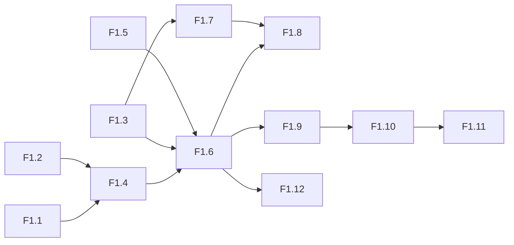
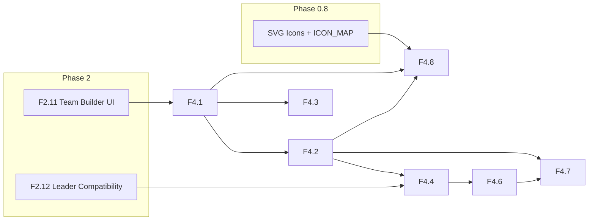

# Features — Документация фич

Полный индекс всех feature-спецификаций по фазам разработки.
Каждый файл содержит: SMART-цель, data model, implementation details, тесты.

---

## Phase 1: Combat Engine

**Цель:** `curl /api/simulate` → JSON с распределением урона.

| # | Фича | Часы | Приоритет |
|---|------|------|-----------|
| [F1.1](f1.1-unit-dataclass.md) | Unit Dataclass — расширение полей | 2h | 1 |
| [F1.2](f1.2-weapon-dataclass.md) | Weapon Dataclass — DiceExpr | 1h | 1 |
| [F1.3](f1.3-modifier-system.md) | Modifier System — ±1, caps, rerolls | 3h | 2 |
| [F1.4](f1.4-wiki-loader.md) | Wiki Loader — парсинг .md → Unit/Weapon | 4h | 2 |
| [F1.5](f1.5-dice-pool.md) | Dice Pool — NumPy D6 Monte Carlo | 2h | 2 |
| [F1.6](f1.6-combat-sequence.md) | Combat Sequence — Hit→Wound→Save→Damage→FNP | 4h | 3 |
| [F1.7](f1.7-weapon-keywords.md) | Weapon Keywords — Sustained, Lethal, Devastating | 3h | 3 |
| [F1.8](f1.8-tests.md) | Tests — Shoota vs Marine, HB vs Marine, Plasma | 2h | 4 |
| [F1.9](f1.9-api-simulate.md) | POST /api/simulate — Weapon × Target → JSON | 2h | 4 |
| [F1.10](f1.10-pmf-chart.md) | PMF Chart — Chart.js распределение урона | 4h | 5 |
| [F1.11](f1.11-round-viewer-stub.md) | Round Viewer Stub — форма + JSON | 2h | 5 |
| [F1.12](f1.12-multiattack.md) | MultiAttack — несколько оружий + отряды | 3h | 5 |

**Всего:** 12 features, ~30 часов. 🚧 20%

### Сводка зависимостей (Phase 1)

### Рекомендуемый порядок имплементации

| Шаг | Фичи | Почему |
|-----|------|--------|
| 1 | **F1.1 + F1.2** — dataclasses | Уже есть, доработать |
| 2 | **F1.5** — Dice pool | Независим |
| 3 | **F1.4** — Wiki Loader | Нужны F1.1/F1.2 |
| 4 | **F1.3** — Modifier system | Нужен F1.5 |
| 5 | **F1.6** — Combat sequence | Нужно всё выше |
| 6 | **F1.7** — Keywords | Расширяет F1.6 |
| 7 | **F1.8** — Tests | После F1.6+F1.7 |
| 8 | **F1.9** — API | После F1.6 |
| 9 | **F1.12** — MultiAttack | Расширяет F1.6 |
| 10 | **F1.10+F1.11** — UI | После F1.9 |

---

## Phase 2: Game System

**Цель:** Собрать две армии, расставить на карте, прожить 1 раунд.

| # | Фича | Часы | Приоритет |
|---|------|------|-----------|
| [F2.1](f2.1-game-state.md) | Game State Dataclass | 4h | 1 |
| [F2.2](f2.2-2d-map.md) | 2D Map — NumPy grid, terrain, deploy zones | 6h | 1 |
| [F2.3](f2.3-line-of-sight.md) | Line of Sight — Bresenham ray casting | 4h | 2 |
| [F2.4](f2.4-missions.md) | Missions — objectives, scoring, deployment | 3h | 2 |
| [F2.5](f2.5-game-loop.md) | Game Loop — 6 фаз, run_round() | 6h | 2 |
| [F2.6](f2.6-phase-transitions.md) | Phase Transitions — priority, alternating activations | 4h | 3 |
| [F2.7](f2.7-battle-shock-cp-stratagems.md) | Battle-shock, CP, Stratagems | 4h | 3 |
| [F2.8](f2.8-victory-points.md) | Victory Points — tracking, end-game | 2h | 3 |
| [F2.9](f2.9-roster-validation.md) | Roster Validation — PTS, Warlord, caps | 3h | 4 |
| [F2.10](f2.10-roster-crud.md) | Roster CRUD — SQLite save/load/delete | 2h | 4 |
| [F2.11](f2.11-team-builder-ui.md) | Team Builder UI — Aline.js, PTS bar | 8h | 5 |
| [F2.12](f2.12-leader-compatibility.md) | Leader Compatibility Checker | 3h | 5 |

**Всего:** 12 features, ~45 часов. ⏳ 0%

---

## Phase 3: AI & Automation

**Цель:** Нажать "Simulate" → AI разыгрывает 5 раундов → replay.

| # | Фича | Часы | Приоритет |
|---|------|------|-----------|
| [F3.1](f3.1-greedy-decision-engine.md) | Greedy decision engine — target/action evaluation | 6h | 1 | ✅ |
| [F3.2](f3.2-faction-ai-profiles.md) | Faction AI Profiles — wiki-driven (Orks, Tau, AdMech) | 4h | 2 | ⏳ |
| [F3.3](f3.3-deployment-ai.md) | Deployment AI: zone placement logic | 3h | 3 | ⏳ |
| [F3.4](f3.4-autoplay.md) | Auto-play: AI vs AI full scenario | 6h | 3 | ⏳ |
| [F3.5](f3.5-replay-recording.md) | Replay recording: JSON event log per round/phase | 3h | 4 | ⏳ |
| [F3.6](f3.6-round-viewer.md) | Round viewer: step-by-step replay UI | 6h | 5 | ⏳ |
| [F3.7](f3.7-result-screen.md) | Result screen: kills, damage, VP timeline chart | 3h | 5 | ⏳ |

**Всего:** 7 features, ~35 часов. 🟢 14%

### Рекомендуемый порядок имплементации

| Шаг | Фичи | Почему |
|-----|------|--------|
| 1 | **F3.1** — Greedy decision engine | Ядро AI, готово ✅ |
| 2 | **F3.2** — Faction AI Profiles | Читает профили из wiki, без хардкода |
| 3 | **F3.3** — Deployment AI | Нужен для полного цикла |
| 4 | **F3.4** — Auto-play | Интеграция всех компонентов |
| 5 | **F3.5** — Replay recording | Логирование результатов |
| 6 | **F3.6 + F3.7** — Round viewer + Result screen | UI для просмотра реплеев |

---

## Phase 5: Production

**Цель:** Приложение на сервере, HTTPS, мониторинг.

| # | Фича | Часы | Приоритет |
|---|------|------|-----------|
| [F5.1](f5.1-dockerfile-compose.md) | Dockerfile + docker-compose | 3h | 1 |
| [F5.2](f5.2-deployment.md) | Deployment (Dokku / Railway / self-host) | 4h | 1 |
| [F5.3](f5.3-rate-limiting.md) | Rate limiting (slowapi) | 1h | 2 |
| [F5.4](f5.4-cors-csp-security.md) | CORS hardening + CSP security headers | 1h | 2 |
| [F5.5](f5.5-logging-sentry.md) | Logging (structlog) + Sentry error tracking | 2h | 3 |
| [F5.6](f5.6-cicd-github-actions.md) | CI/CD: GitHub Actions (lint + test + deploy) | 4h | 3 |
| [F5.7](f5.7-sqlite-backup.md) | SQLite backup strategy + restore script | 1h | 4 |

**Всего:** 7 features, ~16 часов. ⏳ 0%

### Рекомендуемый порядок имплементации

| Шаг | Фичи | Почему |
|-----|------|--------|
| 1 | **F5.1** — Dockerfile + compose | Основа для деплоя |
| 2 | **F5.2** — Deployment | Развернуть приложение |
| 3 | **F5.3** — Rate limiting | Защита от ботов |
| 4 | **F5.4** — CORS + CSP | Безопасность |
| 5 | **F5.5** — Logging + Sentry | Мониторинг |
| 6 | **F5.6** — CI/CD | Автоматизация |
| 7 | **F5.7** — SQLite backup | Надёжность данных |

---

---

## Phase 4: Web UI Polish

**Цель:** Полноценное веб-приложение, готовое к пользователям.

| # | Фича | Часы | Приоритет |
|---|------|------|-----------|
| [F4.1](f4.1-faction-browser.md) | Faction browser with category/PTS filter | 4h | 1 |
| [F4.2](f4.2-unit-modal.md) | Unit modal: squad size, loadout, wargear selection | 6h | 1 |
| [F4.3](f4.3-detachment-picker.md) | Detachment picker with rule preview | 3h | 2 |
| [F4.4](f4.4-synergy-hints.md) | Synergy hints: leader compatibility, transport capacity | 4h | 2 |
| [F4.5](f4.5-canvas-map.md) | Canvas map: terrain tiles + deploy zones interactivity | 8h | 3 |
| [F4.6](f4.6-progressive-disclosure.md) | Progressive Disclosure: Beginner/Intermediate/Expert modes | 4h | 4 |
| [F4.7](f4.7-stat-tooltips.md) | Tooltips on every stat (M/T/SV/W/LD/OC) | 3h | 4 |
| [F4.8](f4.8-svg-icons.md) | SVG icons integration in unit cards | 2h | 5 |

**Всего:** 8 features, ~35 часов. ⏳ 0%

### Сводка зависимостей (Phase 4)

### Рекомендуемый порядок имплементации

| Шаг | Фичи | Почему |
|-----|------|--------|
| 1 | **F4.1** — Faction browser | База для всего UI, нужно сначала |
| 2 | **F4.2** — Unit modal | Зависит от F4.1, ядро взаимодействия |
| 3 | **F4.3** — Detachment picker | Независим после F4.1 |
| 4 | **F4.8** — SVG icons | Быстрая победа, разносится по всем карточкам |
| 5 | **F4.4** — Synergy hints | Нужны F4.2, F2.12 |
| 6 | **F4.7** — Stat tooltips | Распределяется по всем страницам |
| 7 | **F4.6** — Progressive Disclosure | Меняет поведение всех остальных UI |
| 8 | **F4.5** — Canvas map | Самый большой, можно делать параллельно |

---

## Сводка

| Фаза | Features | Часы | Статус |
|------|----------|------|--------|
| **Phase 1** — Combat Engine | 12 | ~30h | 🚧 20% |
| **Phase 2** — Game System | 12 | ~45h | ⏳ 0% |
|| **Phase 3** — AI & Automation | 8 | ~35h | ⏳ 0% |
|| **Phase 4** — Web UI Polish | 8 | ~35h | ⏳ 0% |
|| **Phase 5** — Production | 7 | ~16h | ⏳ 0% |
|| **Phase 6** — Monetization | 6 | ~15h | ⏳ 0% |
|| **Phase 7** — Expansion | 10 | ~40h | ⏳ 0% |
|| **Итого** | **~73** | **~251h** | |
