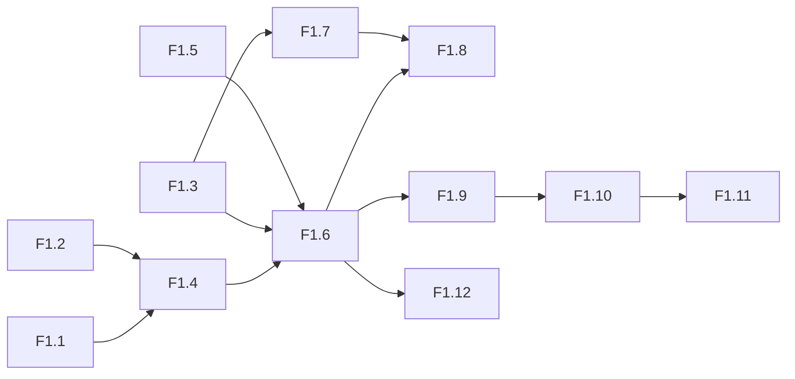

# Features — Документация фич

Полный индекс всех feature-спецификаций по фазам разработки.
Каждый файл содержит: SMART-цель, data model, implementation details, тесты.

---

## Phase 1: Combat Engine

**Цель:** `curl /api/simulate` → JSON с распределением урона.

| # | Фича | Часы | Приоритет |
|---|------|------|-----------|
| [F1.1](f1.1-unit-dataclass.md) | Unit Dataclass — расширение полей | 2h | 1 |
| [F1.2](f1.2-weapon-dataclass.md) | Weapon Dataclass — DiceExpr | 1h | 1 |
| [F1.3](f1.3-modifier-system.md) | Modifier System — ±1, caps, rerolls | 3h | 2 |
| [F1.4](f1.4-wiki-loader.md) | Wiki Loader — парсинг .md → Unit/Weapon | 4h | 2 |
| [F1.5](f1.5-dice-pool.md) | Dice Pool — NumPy D6 Monte Carlo | 2h | 2 |
| [F1.6](f1.6-combat-sequence.md) | Combat Sequence — Hit→Wound→Save→Damage→FNP | 4h | 3 |
| [F1.7](f1.7-weapon-keywords.md) | Weapon Keywords — Sustained, Lethal, Devastating | 3h | 3 |
| [F1.8](f1.8-tests.md) | Tests — Shoota vs Marine, HB vs Marine, Plasma | 2h | 4 |
| [F1.9](f1.9-api-simulate.md) | POST /api/simulate — Weapon × Target → JSON | 2h | 4 |
| [F1.10](f1.10-pmf-chart.md) | PMF Chart — Chart.js распределение урона | 4h | 5 |
| [F1.11](f1.11-round-viewer-stub.md) | Round Viewer Stub — форма + JSON | 2h | 5 |
| [F1.12](f1.12-multiattack.md) | MultiAttack — несколько оружий + отряды | 3h | 5 |

**Всего:** 12 features, ~30 часов. 🚧 20%

### Сводка зависимостей (Phase 1)

### Рекомендуемый порядок имплементации

| Шаг | Фичи | Почему |
|-----|------|--------|
| 1 | **F1.1 + F1.2** — dataclasses | Уже есть, доработать |
| 2 | **F1.5** — Dice pool | Независим |
| 3 | **F1.4** — Wiki Loader | Нужны F1.1/F1.2 |
| 4 | **F1.3** — Modifier system | Нужен F1.5 |
| 5 | **F1.6** — Combat sequence | Нужно всё выше |
| 6 | **F1.7** — Keywords | Расширяет F1.6 |
| 7 | **F1.8** — Tests | После F1.6+F1.7 |
| 8 | **F1.9** — API | После F1.6 |
| 9 | **F1.12** — MultiAttack | Расширяет F1.6 |
| 10 | **F1.10+F1.11** — UI | После F1.9 |

---

## Phase 2: Game System

**Цель:** Собрать две армии, расставить на карте, прожить 1 раунд.

| # | Фича | Часы | Приоритет |
|---|------|------|-----------|
| [F2.1](f2.1-game-state.md) | Game State Dataclass | 4h | 1 |
| [F2.2](f2.2-2d-map.md) | 2D Map — NumPy grid, terrain, deploy zones | 6h | 1 |
| [F2.3](f2.3-line-of-sight.md) | Line of Sight — Bresenham ray casting | 4h | 2 |
| [F2.4](f2.4-missions.md) | Missions — objectives, scoring, deployment | 3h | 2 |
| [F2.5](f2.5-game-loop.md) | Game Loop — 6 фаз, run_round() | 6h | 2 |
| [F2.6](f2.6-phase-transitions.md) | Phase Transitions — priority, alternating activations | 4h | 3 |
| [F2.7](f2.7-battle-shock-cp-stratagems.md) | Battle-shock, CP, Stratagems | 4h | 3 |
| [F2.8](f2.8-victory-points.md) | Victory Points — tracking, end-game | 2h | 3 |
| [F2.9](f2.9-roster-validation.md) | Roster Validation — PTS, Warlord, caps | 3h | 4 |
| [F2.10](f2.10-roster-crud.md) | Roster CRUD — SQLite save/load/delete | 2h | 4 |
| [F2.11](f2.11-team-builder-ui.md) | Team Builder UI — Aline.js, PTS bar | 8h | 5 |
| [F2.12](f2.12-leader-compatibility.md) | Leader Compatibility Checker | 3h | 5 |

**Всего:** 12 features, ~45 часов. ⏳ 0%

---

## Сводка

| Фаза | Features | Часы | Статус |
|------|----------|------|--------|
| **Phase 1** — Combat Engine | 12 | ~30h | 🚧 20% |
| **Phase 2** — Game System | 12 | ~45h | ⏳ 0% |
| **Phase 3** — AI & Automation | 8 | ~25h | ⏳ |
| **Phase 4** — Web UI Polish | 8 | ~35h | ⏳ |
| **Phase 5** — Production | 7 | ~15h | ⏳ |
| **Phase 6** — Monetization | 6 | ~15h | ⏳ |
| **Phase 7** — Expansion | 10 | ~40h | ⏳ |
| **Итого** | **~75** | **~240h** | |
