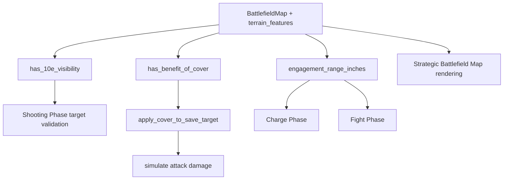

# F2.18: Terrain Mechanics 10e — полная модель ландшафта, укрытия и видимости

**Файлы:** `backend/state/map.py`, `backend/state/line_of_sight.py`, `backend/engine/combat.py`, `backend/engine/scenario.py`, `web/static/battlefield_map.js`, `web/templates/partials/battlefield_map.html`
**Зависимости:** F2.2 (BattlefieldMap), F2.3 (Line of Sight), F2.5 (Game Loop), F2.13 (Cover & Terrain Effects), F4.14 (Strategic Battlefield Map)
**Источник правил:** `wiki/raw/papers/Terrain.md`

**Цель (SMART):** Реализовать 10th Edition terrain subsystem, где crater, barricade, debris, hill, woods и ruins имеют разные правила Benefit of Cover, Visibility, Engagement Range и Plunging Fire; критерий приёмки — тесты подтверждают таблицу правил из `wiki/raw/papers/Terrain.md`, shooting phase применяет +1 к save только когда условие terrain выполнено, ruins блокируют LoS через footprint, barricades дают engagement range 2", woods/ruins исключают Aircraft/Towering из обычного cover-rule, а Plunging Fire даёт AP -1 при стрельбе с высоты более 6"; реалистично за 10 часов, нужно для тактической карты и корректной симуляции стрельбы/чарджа.

---

## Требование

Текущая F2.13 закрывает только упрощённый cover через grid terrain. F2.18 должна заменить это на явную модель terrain feature, где эффект зависит не только от клетки, но и от:

- категории terrain;
- footprint/области terrain;
- положения модели внутри/снаружи footprint;
- линии видимости shooter → target;
- keyword-ов модели (`infantry`, `aircraft`, `towering`);
- высоты shooter/target;
- типа атаки: ranged, indirect, melee, charge.

F2.13 остаётся базовым слой для `+1 SV`; F2.18 уточняет правила и должна быть обратно совместима с существующими сценариями без terrain features.

---

## Rule Matrix

| Terrain category | Benefit of Cover condition | Eligible models | Visibility / attack rules |
|---|---|---|---|
| `crater` | Модель полностью внутри footprint | Только `infantry` | Cover даётся даже если модель полностью видна |
| `barricade` | Модель в пределах 3" и terrain частично скрывает её от attacker | Только `infantry` | Engagement Range через barricade = 2" |
| `debris` | Модель частично скрыта terrain от attacker | Любые модели | Стандартная Line of Sight |
| `hill` | Модель частично скрыта terrain от attacker | Любые модели | Можно стоять сверху; height участвует в Plunging Fire только если feature задаёт elevation |
| `woods` | Модель полностью внутри woods или LoS проходит сквозь woods | Любые, кроме `aircraft` и `towering` | Модели полностью внутри woods считаются not fully visible |
| `ruins` | Модель полностью внутри ruins или ruins частично скрывают её от attacker | Любые, кроме специальных исключений для `aircraft`/`towering` | Footprint полностью блокирует visibility сквозь себя; модели внутри могут видеть наружу и быть видимыми снаружи; Plunging Fire при высоте >6" |

---

## Domain Model

```python
# backend/state/terrain.py или backend/state/map.py
from dataclasses import dataclass
from enum import Enum

class TerrainCategory(str, Enum):
    OPEN = "open"
    CRATER = "crater"
    BARRICADE = "barricade"
    DEBRIS = "debris"
    HILL = "hill"
    WOODS = "woods"
    RUINS = "ruins"

@dataclass(frozen=True)
class TerrainFeature:
    id: str
    category: TerrainCategory
    footprint: set[tuple[int, int]]
    height_inches: float = 0.0
    blocks_movement: bool = False
    blocks_los_footprint: bool = False
    grants_cover: bool = True
```

`BattlefieldMap` должен хранить не только `terrain: np.ndarray`, но и список/словарь features:

```python
@dataclass
class BattlefieldMap:
    width: int
    height: int
    terrain: np.ndarray
    terrain_features: dict[str, TerrainFeature] = field(default_factory=dict)
```

Backward compatibility:

- старый `terrain` grid остаётся валидным;
- при отсутствии `terrain_features` все новые функции возвращают старое поведение или no-op;
- F4.14 Strategic Battlefield Map может рисовать новые features, но не обязан блокировать запуск старых replays.

---

## Core API / Functions

### Terrain lookup

```python
def terrain_at(position: tuple[int, int], battlefield: BattlefieldMap) -> list[TerrainFeature]:
    """Вернуть все terrain features, footprint которых содержит position."""
```

```python
def line_intersects_feature(
    start: tuple[int, int],
    end: tuple[int, int],
    feature: TerrainFeature,
) -> bool:
    """True если Bresenham/ray line проходит через footprint feature."""
```

### Visibility

```python
def has_10e_visibility(
    shooter_pos: tuple[int, int],
    target_pos: tuple[int, int],
    battlefield: BattlefieldMap,
    shooter_keywords: set[str],
    target_keywords: set[str],
) -> bool:
    """10e visibility with ruins magic-box footprint blocking.

    Rules:
    - ruins block LoS through footprint when both models are outside the same ruins;
    - if shooter or target is inside the ruins footprint, visibility is normal to/from that feature;
    - aircraft/towering ignore ruins footprint blocking per simplified project rule;
    - woods do not fully block LoS, but make target not fully visible for cover checks.
    """
```

### Benefit of Cover

```python
def has_benefit_of_cover(
    shooter_pos: tuple[int, int],
    target_pos: tuple[int, int],
    battlefield: BattlefieldMap,
    target_keywords: set[str],
) -> bool:
    """Evaluate 10e Benefit of Cover by terrain category."""
```

Required behavior:

- `crater`: `infantry` target fully inside footprint → cover;
- `barricade`: `infantry` target within 3" and line is partially obscured by feature → cover;
- `debris`: any target partially obscured → cover;
- `hill`: any target partially obscured → cover;
- `woods`: target fully inside woods OR line crosses woods → cover unless target has `aircraft`/`towering`;
- `ruins`: target fully inside ruins OR ruins partially obscure target → cover unless simplified exception applies;
- ranged attacks only;
- `Ignores Cover` cancels the benefit.

### Save modifier

```python
def apply_cover_to_save_target(
    save_target: int,
    weapon_ap: int,
    has_cover: bool,
    ignores_cover: bool,
) -> int:
    """Apply +1 save from Benefit of Cover.

    10e restriction:
    cover must not improve a 3+ or better save to 2+ against AP 0.
    """
```

Acceptance examples:

| Base save | AP | Cover | Effective save |
|---|---:|---:|---:|
| 4+ | 0 | yes | 3+ |
| 3+ | 0 | yes | 3+ |
| 2+ | 0 | yes | 2+ |
| 3+ | -1 | yes | 3+ |
| 4+ | -1 | yes | 4+ |

### Barricade engagement range

```python
def engagement_range_inches(
    attacker_pos: tuple[int, int],
    defender_pos: tuple[int, int],
    battlefield: BattlefieldMap,
) -> float:
    """Return 2.0 if models fight across barricade, otherwise 1.0."""
```

Required behavior:

- if attacker and defender are on opposite sides of the same barricade footprint and both are within 2" of each other, melee engagement is valid;
- this affects Charge success and Fight eligibility;
- it must not globally increase engagement range when no barricade lies between models.

### Plunging Fire

```python
def apply_plunging_fire_ap(
    weapon_ap: int,
    shooter_height: float,
    target_height: float,
    shooter_feature: TerrainFeature | None,
) -> int:
    """Ruins: if shooter is >6" above target, improve AP by 1."""
```

Required behavior:

- only ranged attacks;
- only when shooter stands on/in a ruins feature with `height_inches > 6` or equivalent elevation state;
- AP improves by 1 (`AP 0 -> AP -1`, `AP -1 -> AP -2`);
- no effect in melee.

---

## Integration Flow



Shooting phase order:

1. Compute distance and weapon range.
2. Compute `has_10e_visibility()`.
3. If no LoS and weapon is not `Indirect Fire`, target is invalid.
4. Compute `has_benefit_of_cover()`.
5. If weapon has `Ignores Cover`, cover flag is ignored.
6. Apply Plunging Fire AP before save resolution.
7. Apply cover save modifier with 10e AP0 restriction.
8. Log terrain effects into replay events.

---

## Replay / Logging Requirement

Shooting, charge and fight logs must expose terrain effects for debugging and UI:

```json
{
  "event_type": "terrain_effect",
  "phase": "Shooting",
  "actor": "Shoota Boyz",
  "target": "Intercessors",
  "terrain_id": "ruins_center_1",
  "terrain_category": "ruins",
  "effects": ["line_of_sight_blocked", "benefit_of_cover"]
}
```

Minimum fields:

- `terrain_id`
- `terrain_category`
- `effects`
- `actor`
- `target`
- `phase`

---

## UI Requirement

F4.14 battlefield map should display terrain category and tactical effect:

- ruins: blocks LoS through footprint, cover, possible Plunging Fire;
- woods: cover / not fully visible;
- barricade: 2" engagement;
- crater: infantry cover inside;
- debris/hill: partial-obscurement cover.

Tooltips should be data-driven from `TerrainFeature.category`, not hardcoded in HTML.

---

## Acceptance Criteria

1. Terrain features can be added to `BattlefieldMap` with category, footprint and optional height.
2. Ruins block LoS through footprint when both units are outside the ruins.
3. A unit inside ruins can see out and can be seen from outside if line reaches its footprint.
4. Woods grant cover when target is inside or LoS crosses woods, but do not fully block LoS.
5. Craters grant cover only to `infantry` fully inside the crater.
6. Barricades grant cover only to `infantry` within 3" and partially obscured.
7. Barricades allow 2" engagement only across the barricade.
8. Debris and hills grant cover to any partially obscured model.
9. `aircraft` and `towering` do not receive woods/ruins cover under the simplified 10e terrain rule.
10. `Ignores Cover` cancels Benefit of Cover.
11. Cover does not improve a 3+ or better save to 2+ against AP0.
12. Plunging Fire from ruins height >6" improves AP by 1 against lower targets.
13. Replay logs include terrain effect events when terrain changes LoS, cover, AP or engagement.
14. Existing no-terrain simulations remain unchanged.

---

## Tests

```python
# tests/test_terrain_mechanics_10e.py

def test_ruins_block_los_through_footprint_when_both_units_outside(): ...

def test_ruins_inside_model_can_see_out(): ...

def test_woods_grant_cover_when_los_crosses_woods_without_blocking_los(): ...

def test_crater_cover_only_for_infantry_inside(): ...

def test_barricade_engagement_range_two_inches_only_across_barricade(): ...

def test_debris_grants_cover_to_vehicle_when_partially_obscured(): ...

def test_hill_grants_cover_when_partially_obscured(): ...

def test_aircraft_and_towering_skip_woods_and_ruins_cover(): ...

def test_ignores_cover_cancels_benefit_of_cover(): ...

def test_cover_does_not_turn_three_plus_save_into_two_plus_against_ap_zero(): ...

def test_cover_offsets_ap_minus_one_for_three_plus_save(): ...

def test_plunging_fire_from_ruins_height_over_six_improves_ap(): ...

def test_no_terrain_backwards_compatibility_matches_existing_damage_distribution(): ...
```

Additional integration tests:

```python
# tests/test_autoplay_terrain_integration.py

def test_shooting_phase_logs_cover_from_ruins(): ...

def test_charge_phase_accepts_two_inch_barricade_engagement(): ...
```

---

## Implementation Notes

- Do not infer terrain category from random integer constants alone. Use `TerrainFeature.category` as the source of rule behavior.
- Do not hardcode terrain tooltips in templates. Send category/effects from API or JS data model.
- Do not make all terrain block LoS. In 10e, ruins are the special case for footprint blocking; woods usually affect visibility/cover, not full target validity.
- Do not apply cover to melee attacks.
- Do not globally use 2" engagement range; it is barricade-specific.
- Keep old `TerrainType` compatibility until all old tests and maps are migrated.
