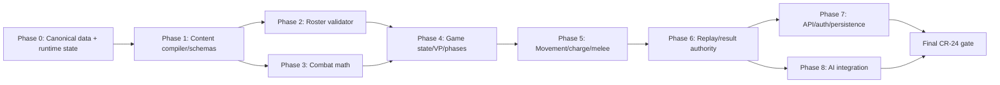

# Remediation Atomic Task Index

**Source:** [remediation-plan.md](remediation-plan.md)

Generated atomic task set: 31 task files. Each task file links back to this index and to previous/next tasks.

## Dependency graph

## Atomic tasks

### Phase 0 — Canonical Data + Runtime State Stabilization

| Task | File | Primary CRs | Depends on | Verification |
| --- | --- | --- | --- | --- |
| 0.1 — Define runtime unit identity contract | [task-00-01-define-runtime-unit-identity-contract.md](task-00-01-define-runtime-unit-identity-contract.md) | CR-05, CR-06, CR-12, CR-14, CR-20. | none | `uv run python -m pytest tests/test_game_state.py tests/test_autoplay.py -q` |
| 0.2 — Normalize GameState serialization boundaries | [task-00-02-normalize-gamestate-serialization-boundaries.md](task-00-02-normalize-gamestate-serialization-boundaries.md) | CR-05, CR-06, CR-12, CR-14, CR-20. | [0.1 — Define runtime unit identity contract](task-00-01-define-runtime-unit-identity-contract.md) | `uv run python -m pytest tests/test_replay.py tests/test_round_viewer.py tests/test_result_screen.py -q` |
| 0.3 — Stop destructive DB/replay behavior before further fixes | [task-00-03-stop-destructive-db-replay-behavior-before-further-fixes.md](task-00-03-stop-destructive-db-replay-behavior-before-further-fixes.md) | CR-05, CR-06, CR-12, CR-14, CR-20. | [0.2 — Normalize GameState serialization boundaries](task-00-02-normalize-gamestate-serialization-boundaries.md) | `uv run python -m pytest tests/test_replay.py tests/test_db*.py -q` |

### Phase 1 — Content compiler / schemas

| Done | Task | File | Primary CRs | Depends on | Verification |
| --- | --- | --- | --- | --- | --- |
| [x] | 1.1 — Create content contract tests | [task-01-01-create-content-contract-tests.md](task-01-01-create-content-contract-tests.md) | CR-06, CR-11, CR-12, CR-21. | Phase 0 checkpoint | `uv run python -m pytest tests/test_content_contracts.py -q` |
| [x] | 1.2 — Replace unsafe/stale cache behavior | [task-01-02-replace-unsafe-stale-cache-behavior.md](task-01-02-replace-unsafe-stale-cache-behavior.md) | CR-06, CR-11, CR-12, CR-21. | [1.1 — Create content contract tests](task-01-01-create-content-contract-tests.md) | `uv run python -m pytest tests/test_content_contracts.py -q` |
| [x] | 1.3 — Compile squad/points metadata consistently | [task-01-03-compile-squad-points-metadata-consistently.md](task-01-03-compile-squad-points-metadata-consistently.md) | CR-06, CR-11, CR-12, CR-21. | [1.2 — Replace unsafe/stale cache behavior](task-01-02-replace-unsafe-stale-cache-behavior.md) | `uv run python -m pytest tests/test_parser.py tests/test_roster*.py -q` |
| [x] | 1.4 — Emit canonical JSON artifacts | [task-01-04-emit-canonical-json-artifacts.md](task-01-04-emit-canonical-json-artifacts.md) | CR-06, CR-11, CR-12, CR-21. | [1.3 — Compile squad/points metadata consistently](task-01-03-compile-squad-points-metadata-consistently.md) | `uv run python -m pytest tests/test_content_contracts.py -q` |
| [x] | 1.5 — Adopt frontmatter canonical IDs | [task-01-05-adopt-frontmatter-canonical-ids.md](task-01-05-adopt-frontmatter-canonical-ids.md) | CR-06, CR-11, CR-12, CR-21. | [1.4 — Emit canonical JSON artifacts](task-01-04-emit-canonical-json-artifacts.md) | `uv run python -m pytest tests/test_content_contracts.py -q` |

### Phase 2 — Roster validator

| Done | Task | File | Primary CRs | Depends on | Verification |
| --- | --- | --- | --- | --- | --- |
| [x] | 2.1 — Lock the canonical PTS formula | [task-02-01-lock-the-canonical-pts-formula.md](task-02-01-lock-the-canonical-pts-formula.md) | CR-12, CR-16, CR-17, CR-19. | [1.4 — Emit canonical JSON artifacts](task-01-04-emit-canonical-json-artifacts.md), Phase 1 checkpoint | `uv run python -m pytest tests/test_roster*.py -q` Browser/API smoke if frontend changed. |
| [ ] | 2.2 — Enforce exactly one Warlord when required | [task-02-02-enforce-exactly-one-warlord-when-required.md](task-02-02-enforce-exactly-one-warlord-when-required.md) | CR-12, CR-16, CR-17, CR-19. | [2.1 — Lock the canonical PTS formula](task-02-01-lock-the-canonical-pts-formula.md) | `uv run python -m pytest tests/test_roster*.py tests/test_rosters.py -q` Browser smoke `/team-builder` for crown/warning/save-disabled state. |
| [x] | 2.3 — Enforce plan/feature gates consistently | [task-02-03-enforce-plan-feature-gates-consistently.md](task-02-03-enforce-plan-feature-gates-consistently.md) | CR-12, CR-16, CR-17, CR-19. | [2.2 — Enforce exactly one Warlord when required](task-02-02-enforce-exactly-one-warlord-when-required.md) | `uv run python -m pytest tests/test_rosters.py -q` |

### Phase 3 — Combat math

| Done | Task | File | Primary CRs | Depends on | Verification |
| --- | --- | --- | --- | --- | --- |
| [x] | 3.1 — Fix natural 6 / Lethal Hits semantics | [task-03-01-fix-natural-6-lethal-hits-semantics.md](task-03-01-fix-natural-6-lethal-hits-semantics.md) | CR-07, CR-11. | [1.4 — Emit canonical JSON artifacts](task-01-04-emit-canonical-json-artifacts.md), Phase 1 checkpoint | `uv run python -m pytest tests/test_combat*.py tests/test_modifiers.py -q` |
| [ ] | 3.2 — Fix AP/save application and Devastating Wounds | [task-03-02-fix-ap-save-application-and-devastating-wounds.md](task-03-02-fix-ap-save-application-and-devastating-wounds.md) | CR-07, CR-11. | [3.1 — Fix natural 6 / Lethal Hits semantics](task-03-01-fix-natural-6-lethal-hits-semantics.md) | `uv run python -m pytest tests/test_combat*.py tests/test_terrain*.py -q` |
| [ ] | 3.3 — Fix Sustained Hits resolution | [task-03-03-fix-sustained-hits-resolution.md](task-03-03-fix-sustained-hits-resolution.md) | CR-07, CR-11. | [3.2 — Fix AP/save application and Devastating Wounds](task-03-02-fix-ap-save-application-and-devastating-wounds.md) | `uv run python -m pytest tests/test_modifiers.py tests/test_combat*.py -q` |

### Phase 4 — Game state / VP / phase invariants

| Task | File | Primary CRs | Depends on | Verification |
| --- | --- | --- | --- | --- |
| 4.1 — Assert 5-phase 10e loop invariants | [task-04-01-assert-5-phase-10e-loop-invariants.md](task-04-01-assert-5-phase-10e-loop-invariants.md) | CR-08, CR-10, CR-14, CR-24. | Phase 2, 3 checkpoint | `uv run python -m pytest tests/test_game_state.py tests/test_scenario.py -q` |
| 4.2 — Lock CP and battle-shock reset semantics | [task-04-02-lock-cp-and-battle-shock-reset-semantics.md](task-04-02-lock-cp-and-battle-shock-reset-semantics.md) | CR-08, CR-10, CR-14, CR-24. | [4.1 — Assert 5-phase 10e loop invariants](task-04-01-assert-5-phase-10e-loop-invariants.md) | `uv run python -m pytest tests/test_game_state.py tests/test_scenario.py -q` |
| 4.3 — Lock VP, objectives, mission normalization, Battle Ready | [task-04-03-lock-vp-objectives-mission-normalization-battle-ready.md](task-04-03-lock-vp-objectives-mission-normalization-battle-ready.md) | CR-08, CR-10, CR-14, CR-24. | [4.2 — Lock CP and battle-shock reset semantics](task-04-02-lock-cp-and-battle-shock-reset-semantics.md) | `uv run python -m pytest tests/test_mission*.py tests/test_autoplay.py tests/test_result_screen.py -q` |

### Phase 5 — Movement / charge / melee identity

| Task | File | Primary CRs | Depends on | Verification |
| --- | --- | --- | --- | --- |
| 5.1 — Fix charge destination and engagement identity | [task-05-01-fix-charge-destination-and-engagement-identity.md](task-05-01-fix-charge-destination-and-engagement-identity.md) | CR-09, CR-11, CR-14, CR-15. | Phase 4 checkpoint | `uv run python -m pytest tests/test_movement*.py tests/test_scenario.py -q` |
| 5.2 — Fix melee target selection and damage logging | [task-05-02-fix-melee-target-selection-and-damage-logging.md](task-05-02-fix-melee-target-selection-and-damage-logging.md) | CR-09, CR-11, CR-14, CR-15. | [5.1 — Fix charge destination and engagement identity](task-05-01-fix-charge-destination-and-engagement-identity.md) | `uv run python -m pytest tests/test_scenario.py tests/test_result_screen.py -q` |
| 5.3 — Fix terrain/LoS movement-related blockers | [task-05-03-fix-terrain-los-movement-related-blockers.md](task-05-03-fix-terrain-los-movement-related-blockers.md) | CR-09, CR-11, CR-14, CR-15. | [5.2 — Fix melee target selection and damage logging](task-05-02-fix-melee-target-selection-and-damage-logging.md) | `uv run python -m pytest tests/test_terrain*.py tests/test_scenario.py -q` |

### Phase 6 — Replay/result authoritative state

| Task | File | Primary CRs | Depends on | Verification |
| --- | --- | --- | --- | --- |
| 6.1 — Persist authoritative final snapshot | [task-06-01-persist-authoritative-final-snapshot.md](task-06-01-persist-authoritative-final-snapshot.md) | CR-14, CR-18, CR-24. | Phase 5 checkpoint | `uv run python -m pytest tests/test_replay.py tests/test_result_screen.py -q` Deterministic generated replay smoke. |
| 6.2 — Fix event parsing and summary attribution | [task-06-02-fix-event-parsing-and-summary-attribution.md](task-06-02-fix-event-parsing-and-summary-attribution.md) | CR-14, CR-18, CR-24. | [6.1 — Persist authoritative final snapshot](task-06-01-persist-authoritative-final-snapshot.md) | `uv run python -m pytest tests/test_result_screen.py tests/test_replay.py -q` |
| 6.3 — Add repeatable final gate smoke script | [task-06-03-add-repeatable-final-gate-smoke-script.md](task-06-03-add-repeatable-final-gate-smoke-script.md) | CR-14, CR-18, CR-24. | [6.2 — Fix event parsing and summary attribution](task-06-02-fix-event-parsing-and-summary-attribution.md) | `uv run python scripts/smoke_final_gate.py` |
| 6.4 — Convert api_replays and result runtime to canonical unit IDs | [task-06-04-convert-replay-to-canonical-ids.md](task-06-04-convert-replay-to-canonical-ids.md) | CR-14, CR-18, CR-24. | [6.3 — Add repeatable final gate smoke script](task-06-03-add-repeatable-final-gate-smoke-script.md), Phase 5 checkpoint | `uv run python -m pytest tests/test_replay.py tests/test_result_screen.py -q` |

### Phase 7 — API/auth/persistence hardening

| Task | File | Primary CRs | Depends on | Verification |
| --- | --- | --- | --- | --- |
| 7.1 — Fail closed on secrets/JWT/webhook config | [task-07-01-fail-closed-on-secrets-jwt-webhook-config.md](task-07-01-fail-closed-on-secrets-jwt-webhook-config.md) | CR-02, CR-03, CR-04, CR-05, CR-13, CR-19, CR-20, CR-22. | Phase 6 checkpoint | `uv run python -m pytest tests/test_auth*.py tests/test_billing*.py tests/test_deployment*.py -q` |
| 7.2 — Enforce ownership on roster/replay/subscription APIs | [task-07-02-enforce-ownership-on-roster-replay-subscription-apis.md](task-07-02-enforce-ownership-on-roster-replay-subscription-apis.md) | CR-02, CR-03, CR-04, CR-05, CR-13, CR-19, CR-20, CR-22. | [7.1 — Fail closed on secrets/JWT/webhook config](task-07-01-fail-closed-on-secrets-jwt-webhook-config.md) | `uv run python -m pytest tests/test_api_rosters.py tests/test_api_replays.py tests/test_auth*.py -q` |
| 7.3 — Enforce billing/feature gates consistently | [task-07-03-enforce-billing-feature-gates-consistently.md](task-07-03-enforce-billing-feature-gates-consistently.md) | CR-02, CR-03, CR-04, CR-05, CR-13, CR-19, CR-20, CR-22. | [7.2 — Enforce ownership on roster/replay/subscription APIs](task-07-02-enforce-ownership-on-roster-replay-subscription-apis.md) | `uv run python -m pytest tests/test_billing*.py tests/test_api*.py -q` |
| 7.4 — Production hardening pass | [task-07-04-production-hardening-pass.md](task-07-04-production-hardening-pass.md) | CR-02, CR-03, CR-04, CR-05, CR-13, CR-19, CR-20, CR-22. | [7.3 — Enforce billing/feature gates consistently](task-07-03-enforce-billing-feature-gates-consistently.md) | `uv run python -m pytest tests/test_deployment*.py tests/test_api*.py -q` |

### Phase 8 — AI integration

| Task | File | Primary CRs | Depends on | Verification |
| --- | --- | --- | --- | --- |
| 8.1 — Use decision engine in live scenario phases | [task-08-01-use-decision-engine-in-live-scenario-phases.md](task-08-01-use-decision-engine-in-live-scenario-phases.md) | CR-15, CR-17. | Phase 6 checkpoint | `uv run python -m pytest tests/test_ai_decision.py tests/test_faction_ai.py tests/test_autoplay.py -q` |
| 8.2 — Fix behavior overrides and target priorities | [task-08-02-fix-behavior-overrides-and-target-priorities.md](task-08-02-fix-behavior-overrides-and-target-priorities.md) | CR-15, CR-17. | [8.1 — Use decision engine in live scenario phases](task-08-01-use-decision-engine-in-live-scenario-phases.md) | `uv run python -m pytest tests/test_faction_ai.py tests/test_ai_decision.py -q` |
| 8.3 — Verify deployment objectives and faction styles | [task-08-03-verify-deployment-objectives-and-faction-styles.md](task-08-03-verify-deployment-objectives-and-faction-styles.md) | CR-15, CR-17. | [8.2 — Fix behavior overrides and target priorities](task-08-02-fix-behavior-overrides-and-target-priorities.md) | `uv run python -m pytest tests/test_autoplay.py tests/test_faction_ai.py -q` Deterministic scenario probes with fixed seed. |

### Phase 9 — Final CR-24 re-run

| Task | File | Primary CRs | Depends on | Verification |
| --- | --- | --- | --- | --- |
| 9.1 — Run final CR-24 regression gate and reconcile review metadata | [task-09-01-final-cr-24-regression-gate.md](task-09-01-final-cr-24-regression-gate.md) | CR-24. | [8.3 — Verify deployment objectives and faction styles](task-08-03-verify-deployment-objectives-and-faction-styles.md), Checkpoint 8 | `uv run ruff check .` `uv run ruff format --check .` |

## Global execution rules

- Execute tasks sequentially unless dependencies explicitly allow parallel review-only work.
- Do not mark a task done only because tests pass; CR artifacts and summary metadata must be updated where applicable.
- Preserve the architecture boundaries from the source plan: display name != runtime identity; raw wiki != canonical runtime data; AI decision != state mutation; round snapshots != final result authority.
- After backend changes run ruff, format check, full pytest, local deploy health check when required by the task scope.
- After HTML/JS changes run node syntax checks and browser smoke for affected pages.
