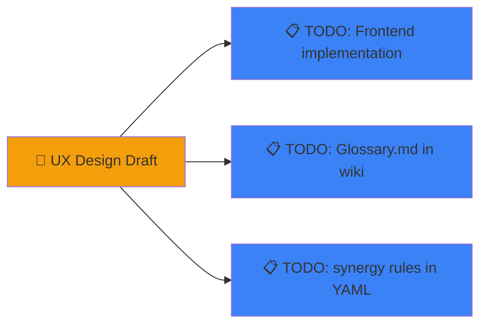

# UX Design (draft)

Предварительные идеи интерфейса. Не реализовано — зафиксировано для разработки.

---

## 1. Progressive Disclosure — три режима

Переключатель в хедере: `[Beginner ●] [Intermediate ○] [Expert ○]`

| Режим | Показываем | Скрываем |
|-------|-----------|----------|
| **Beginner** | Только название, PTS, категория. Оружие — «Shoota (лучше для стрельбы)» | Статы, keywords, таблицы |
| **Intermediate** | Все статы, оружие, базовые keywords | Модификаторы, тонкости LoS |
| **Expert** | Полный datasheet | — |

**Beginner-карточка юнита:**

```
┌─── Boyz ─────────────────────────────────┐
│  ☐ Basic Infantry   80pts               │
│  Лучшие в ближнем бою.                  │
│  Можно взять 10 или 20 бойцов.          │
│                                          │
│  [Shoota — стрельба]                     │
│  [Choppa — ближний бой]  ← рекомендуем   │
│                                          │
│  ❓ Что делает этот отряд?                │
└──────────────────────────────────────────┘
```

---

## 2. Tooltip на каждую стату

При наведении на M/T/SV/W/LD/OC — всплывашка с объяснением.

```
┌──────────────────────────────────────────┐
│  M — Movement (Движение)                  │
│  Сколько дюймов может переместиться       │
│  модель за фазу. 5" = 5 дюймов.           │
│                                          │
│  Ghazghkull: 5"    Warboss: 5"           │
│  Trukk: 12"       Deff Dread: 6"         │
└──────────────────────────────────────────┘
```

**Глоссарий в один клик:** иконка `?` рядом с любой цифрой показывает окно-справку по стате.

```
┌─── T 5 (Toughness 5) ─────────────────────┐
│                                           │
│  Сравнивается с S (Strength) оружия       │
│  при броске на ранение:                   │
│  S 3 → 5+ на D6     S 4 → 4+             │
│  S 5 → 3+           S 10 → 2+             │
│                                           │
│  Boyz T5 — крепкая пехота                 │
│  Gretchin T2 — хрупкие                    │
└───────────────────────────────────────────┘
```

---

## 3. Leader Hints — визуальные подсказки для лидеров

При добавлении лидера (Warboss) — показать совместимые отряды:

```
✅ Warboss — может командовать: Boyz, Nobz, Meganobz
   ┌─────────────────────────────────────────┐
   │ Warboss + Boyz = +1 к попаданию         │
   │ Warboss + Nobz = элитный отряд          │
   │ Warboss + Meganobz = танковый отряд     │
   └─────────────────────────────────────────┘
```

Отряды, ждущие лидера — зелёная подсветка:

```
☑ Boyz×10   80pts  ← этот отряд ждёт лидера
☐ Warboss   65pts  ← присоединится к Boyz
```

Лидер без совместимого отряда — красная подсветка:

```
☒ Ghazghkull Thraka — НЕ может присоединиться к Boyz
✅ Ghazghkull + Meganobz
```

---

## 4. Synergy Engine — подсказки по сборке

Roster Validator — жёсткие блоки:

| Правило | Реакция |
|---------|---------|
| PTS превышен | Красная плашка, нельзя сохранить |
| 3× одинаковых не-Battleline | Красная плашка |
| Лидер без совместимого отряда | Жёлтая плашка |
| Transport не вмещает все модели | Жёлтая плашка |

Synergy Engine — мягкие подсказки:

```
💡 Warboss + Boyz: Warboss даёт переброс попаданий, Boyz — мясо
💡 Ghazghkull требует Meganobz: 4+ FNP + 2+ SV
💡 У тебя 3 танка и 0 анти-пехоты
⚠️ Trukk может взять 11 моделей — у тебя их 22
```

Где хранить: YAML frontmatter `synergies:` в каждом даташите:

```yaml
synergies:
  - with: Boyz
    type: leader
    text: "Warboss повышает выживаемость Boyz. Возьми Painboy для FNP 5+."
  - with: Meganobz
    type: leader
    text: "T5 → T7, 2+ SV. Танковый отряд."
  - with: Ghazghkull
    type: conflict
    text: "Ghazghkull занимает слот Warlord. Warboss не нужен."
```

---

## 5. Team Builder — флоу

### Экран 1: Выбор фракции и рамок

```
▌Faction:  [Orks ▾]
▌Detachment: [War Horde ▾]
▌PTS Limit: [2000 ▾]
▌[Start Building →]
```

### Экран 2: Сборка ростера

```
┌─── LIBRARY ───────────────┐  ┌─── ROSTER ───────────────────────┐
│ 🔍 [Search...]            │  │  Orks | War Horde   1850/2000 ✅ │
│ ▸ Characters (18)         │  │ ████████████████████████████░░░ │
│  ☐ Warboss      65pts     │  │                                  │
│  ☐ Weirdboy     60pts     │  │ Bodyguards:                      │
│ ▸ Battleline (2)          │  │  [Warboss + Boyz×10]   145pts   │
│  ☐ Boyz         80pts     │  │  [Weirdboy + Boyz×10] 140pts   │
│ ▸ Vehicles (15)           │  │  Battleline:                     │
│  ☐ Trukk        65pts     │  │  [Boyz×10]             80pts   │
│ ▸ Elites (12)             │  │  Transport:                      │
│  ☐ Nobz        110pts     │  │  [Trukk]               65pts   │
│  ☐ Meganobz     90pts     │  │  Characters:                     │
│                           │  │  [Warboss]             65pts   │
└───────────────────────────┘  └──────────────────────────────────┘
```

### Модалка добавления юнита

```
┌─── ADD UNIT ──────────────────────────┐
│  Boyz  |  10-20  |  80/160pts         │
│  M 5"  T5  SV6+  W1  LD6+  OC2       │
│                                       │
│  Loadout:                             │
│  ○ Slugga + Choppa  (80pts)  ★ рек.  │
│  ○ Shoota            (80pts)          │
│                                       │
│  Size: [10 ▾]                         │
│  Nob: [Power Klaw ▾]  (+5pts)        │
│                                       │
│  [Add to Roster]                      │
└───────────────────────────────────────┘
```

---

## 6. Визуальная система — карточки с SVG-иконками

### 6.1 Категорийные иконки

16 SVG-иконок в `web/static/icons/`: чистая гейм-стилистика, 24×24 viewBox, monochrome.

| Категория | Иконка | Цвет |
|-----------|--------|------|
| Epic Hero | crown | 🟣 #a855f7 |
| Character | helmet | 🟣 #a855f7 |
| Psyker | psychic glow | 🩷 #ec4899 |
| Medic | cross | 🟢 #22c55e |
| Battleline | crossed rifles | 🟢 #22c55e |
| Elite | star/chevron | 🟡 #eab308 |
| Infantry | soldier | ⚪ #6b7280 |
| Transport | carrier | 🔵 #3b82f6 |
| Vehicle | tank hull | 🔵 #3b82f6 |
| Walker | mechanical legs | 🟠 #f97316 |
| Dreadnought | sarcophagus | 🟠 #f97316 |
| Speed Freek | wheel+flame | 🔴 #ef4444 |
| Monster | maw/claw | 🔴 #ef4444 |
| Titanic | tower | 🔴 #dc2626 |
| Flyer | wing/jet | 🟣 #8b5cf6 |
| Artillery | cannon | 🤎 #78716c |

### 6.2 Карточка юнита

```
┌──────────────────┐
│ 🪖 Warboss       │
│ 65pts · M5 T6 W5 │
│ ⭐ Лидер · ⚔️ CC │
│ [➕ Add]          │
└──────────────────┘
```

Цвет рамки — по категории. Иконка — SVG из `icon_map.py`. Инлайновые статы (M/T/W) для быстрой оценки без клика.

### 6.3 Маппинг

`backend/loader/icon_map.py` — Python-словарь: категория → файл иконки, цвет, label, порядок сортировки.

### Frontend

| Файл | Назначение |
|------|-----------|
| `web/static/tooltips.js` | Alpine.js: `x-data="tooltip"` — показ/скрытие всплывашек |
| `web/static/beginner_mode.js` | Переключение Beginner/Intermediate/Expert |
| `web/static/glossary.js` | Справочник стат с примерами |
| `web/static/leader_hint.js` | Подсветка совместимых лидеров и отрядов |

### Wiki

| Файл | Назначение |
|------|-----------|
| `wiki/rules/10th/Glossary.md` | Справочник стат (M/T/SV/W/LD/OC) для фронта |
| `wiki/synergies/` | Правила синергий лидеров (папка) |

### Статус



---

## 7. Subscription & Billing UX (Free / Premium)

### 7.1 Pricing Page — `/pricing`

Два плана в grid 2×1:

```
┌────────────────────────┐  ┌───────────────────────────────┐
│  Free                   │  │  Premium         🔥 POPULAR  │
│  $0/month               │  │  $7/month                    │
│                         │  │                               │
│  ✅ 3 saved rosters     │  │  ✅ Unlimited rosters         │
│  ✅ Basic AI simulation │  │  ✅ Full AI simulation        │
│  ✅ Browse public       │  │  ✅ Export CSV/JSON           │
│  ❌ Export              │  │  ✅ Public rosters            │
│  ❌ Priority sim        │  │  ✅ Priority sim              │
│  📢 Ads included        │  │  ❌ No ads                    │
│                         │  │                               │
│  [Get Started Free]     │  │  [🔥 Upgrade to Premium]      │
└────────────────────────┘  └───────────────────────────────┘
```

**Логика кнопок (Alpine.js):**
- `!user` → обе кнопки ведут на `/auth/register`
- `user.tier === 'free'` → Free: "You're on Free", Premium: "Upgrade → /api/subscribe"
- `user.tier === 'premium'` → Free: скрыта, Premium: "You're Premium! Manage subscription →"

### 7.2 Header — Tier Badge

```
[FREE]  Balthier  [Logout]       ← жёлтая рамка, серый текст
[⭐ PREMIUM]  Balthier  [Logout]  ← жёлтый текст, жёлтая рамка
```

Отображается сразу после `/api/me` — Alpine.js проверяет `user.tier`.

### 7.3 Upgrade Banner

Для Free-пользователей — жёлтый gradient-баннер под guest banner:

```
╔══════════════════════════════════════════════════════════════╗
║  ⚡ Upgrade to Premium — no ads, unlimited rosters,        ║
║  priority AI  [🔥 Upgrade Now]                             ║
╚══════════════════════════════════════════════════════════════╝
```

Показывается через `<template x-if="user && user.features.ads_enabled">`.

### 7.4 Guest Banner

Для незарегистрированных — серый баннер над навигацией:

```
👋 You're browsing as a guest. [Register] or [Login] to save rosters and run simulations.
```

### 7.5 Ad Placeholder

Серая заглушка под навигацией, только для Free:

```
[ Ad Space — supports free users. Upgrade to Premium to remove. ]
```

В production заменяется на реальный скрипт рекламной сети.

### 7.6 Roster Limit Indicator

В Team Builder — Alpine.js проверяет `user.features.max_rosters`:

```
Free:  Rosters  [3/3]  ⚠️ Upgrade to Premium unlimited
       ████████████████░░░░  1000/2000 pts              ✅

Premium:  Rosters  [3/∞]
          ████████████████░░░░  1000/2000 pts            ✅
```

При попытке создать 2-й ростер (Free) — модалка:

```
┌─── ⚠️ Roster Limit Reached ───────────┐
│                                         │
│  Free plan includes up to 3 rosters.    │
│                                         │
│  [Upgrade to Premium]  [Cancel]         │
└─────────────────────────────────────────┘
```

### 7.7 Feature-Gated UI Элементы

| Элемент | Free | Premium |
|---------|------|---------|
| Экспорт CSV | кнопка скрыта | кнопка в меню |
| Экспорт JSON | кнопка скрыта | кнопка в меню |
| Public roster switch | disabled + tooltip | enabled |
| Priority sim toggle | disabled + tooltip | enabled |
| AI selection | "Basic (Free)" | "Full (Advanced)" |

Tooltip для disabled-элементов:

```
┌─── 🔒 Export ──────────────────────────┐
│  Export is available only on Premium.  │
│  [Upgrade to Premium →]                │
└─────────────────────────────────────────┘
```

### 7.8 Техническая реализация

```html
<!-- Feature gate в шаблоне -->
<template x-if="user.features.export_enabled">
  <button @click="exportRoster()">Export CSV</button>
</template>
<template x-if="!user.features.export_enabled">
  <button disabled class="opacity-50 cursor-not-allowed"
          title="Export available on Premium">
    Export CSV 🔒
  </button>
</template>
```

Feature dict приходит с сервера через `/api/me`:

```json
{
  "id": 1,
  "email": "user@example.com",
  "display_name": "Balthier",
  "tier": "free",
  "features": {
    "max_rosters": 3,
    "ads_enabled": true,
    "export_enabled": false,
    "public_rosters_create": false,
    "priority_simulation": false,
    "simulation_ai": "basic"
  }
}
```
