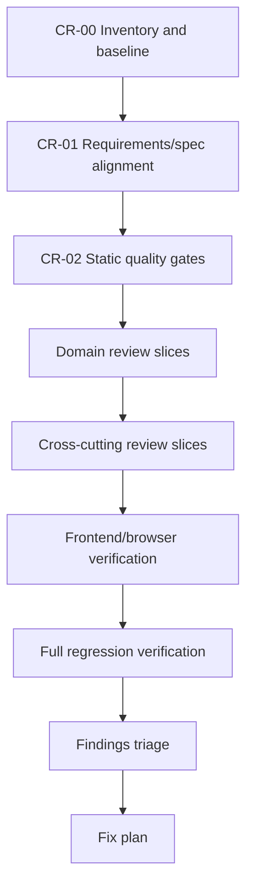
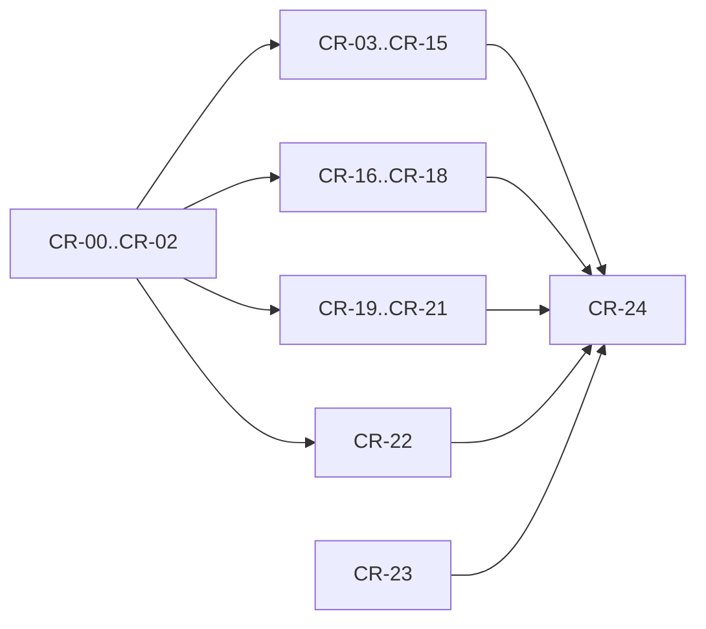

# Code Review Plan — план проверки всего кода

**Источник требования:** `obsidian://open?vault=Balthier&file=agent-skills-0.6.0%2Fagents%2Fcode-reviewer`

**Цель:** разбить слишком большую задачу «проверить весь код» на атомизированные, проверяемые review-задачи, которые можно выполнять по очереди или параллельно независимыми агентами без потери покрытия.

**Базовый review framework:** каждая задача проверки обязана оценивать код по 5 измерениям:

1. Correctness — соответствие требованиям, edge cases, тесты, состояния, off-by-one/race conditions.
2. Readability — понятность, имена, контроль потока, группировка связанной логики.
3. Architecture — следование существующим паттернам, границы модулей, зависимости, отсутствие переусложнения.
4. Security — валидация input, секреты, auth/authz, parameterized queries, output encoding, зависимости.
5. Performance — N+1, unbounded loops/fetching, sync vs async, лишние UI re-render, pagination.

**Итоговый формат каждого review-отчёта:** `APPROVE` или `REQUEST CHANGES`, блоки `Critical`, `Important`, `Suggestions`, `What's Done Well`, `Verification Story`.

---

## 1. Принципы декомпозиции

- Одна задача = один review-slice, один владелец, один отчёт.
- Сначала тесты и требования, потом код.
- Не смешивать review и исправления: review фиксирует findings; fixes идут отдельными задачами после triage.
- Любой `Critical` блокирует merge/release.
- `Important` должен быть либо исправлен, либо явно принят как debt с owner/date.
- `Suggestion` не блокирует, но может попасть в backlog.
- Review должен быть evidence-based: ссылки на `file:line`, команда проверки, фактический вывод.
- Не печатать секреты. Любые credentials/tokens/passwords в отчётах заменять на `[REDACTED]`.

---

## 2. Общий workflow проверки



Для каждого slice:

1. Прочитать связанные feature docs / SRS / C4 / AGENTS.
2. Прочитать связанные tests перед production code.
3. Прочитать production code.
4. Проверить 5 измерений framework.
5. Запустить slice-specific checks.
6. Записать findings в единый отчёт.

---

## 3. Review artifact contract

Каждый atomic review должен создать или обновить один markdown-отчёт:

`docs/reviews/YYYY-MM-DD/<task-id>-<short-name>.md`

Шаблон:

```markdown
# <Task ID> — <Scope>

## Review Summary

**Verdict:** APPROVE | REQUEST CHANGES

**Overview:** 1-2 предложения.

### Critical Issues
- `path/file.py:123` — описание, риск, recommended fix.

### Important Issues
- `path/file.py:123` — описание, recommended fix.

### Suggestions
- `path/file.py:123` — улучшение.

### What's Done Well
- Конкретный положительный пункт.

### Verification Story
- Tests reviewed: yes/no + какие.
- Build verified: yes/no + команда.
- Security checked: yes/no + что проверено.
- Performance checked: yes/no + что проверено.

### Scope Checklist
- [ ] Correctness
- [ ] Readability
- [ ] Architecture
- [ ] Security
- [ ] Performance
```

---

## 4. Atomic tasks

### CR-00 — Inventory and baseline

**Objective:** зафиксировать живое состояние проекта до review, чтобы отличать реальные проблемы от stale docs.

**Files:**
- Read: `pyproject.toml`
- Read: `main.py`
- Read: `DEV_INDEX.md`
- Read: `AGENTS.md`
- Read: `docs/features/Features_index.md`
- Output: `docs/reviews/YYYY-MM-DD/CR-00-inventory-baseline.md`

**Steps:**
1. Выполнить `git status --short` и зафиксировать pre-existing modified files.
2. Выполнить `git branch --show-current`.
3. Посчитать Python/JS/HTML/MD files по директориям.
4. Выполнить `uv run python -m pytest --collect-only -q`.
5. Выполнить `uv run ruff check .`.
6. Выполнить `uv run ruff format --check .`.
7. Выполнить `node -c` для всех JS-файлов из `web/static/*.js`.
8. Сохранить baseline: test count, lint status, known warnings.

**Acceptance:** baseline report создан; есть список scope-директорий и команд проверки.

---

### CR-01 — Requirements and spec alignment map

**Objective:** составить карту «требование → код → тесты», чтобы review не был проверкой на ощущениях.

**Files:**
- Read: `docs/requirements/SRS.md`
- Read: `docs/requirements/UX.md`
- Read: `docs/features/*.md`
- Read: `docs/architecture/C4.md`
- Read: `ROADMAP.md`
- Output: `docs/reviews/YYYY-MM-DD/CR-01-requirements-map.md`

**Steps:**
1. Выделить реализованные фичи со статусом done/in-progress.
2. Для каждой фичи найти primary code paths.
3. Для каждой фичи найти test files.
4. Отметить фичи без тестов.
5. Отметить specs, которые выглядят stale относительно кода.
6. Сформировать таблицу coverage map.

**Acceptance:** есть таблица `Feature / Requirement / Code paths / Tests / Review owner / Risk`.

---

### CR-02 — Static security and secrets scan

**Objective:** найти блокирующие security issues до ручного review.

**Files:**
- Scope: весь repo, кроме `.git`, venv/cache/build artifacts.
- Output: `docs/reviews/YYYY-MM-DD/CR-02-static-security-scan.md`

**Steps:**
1. Проверить hardcoded secrets: `api_key`, `secret`, `password`, `token`, `passwd`.
2. Проверить shell injection patterns: `os.system`, `subprocess.*shell=True`.
3. Проверить dangerous eval/exec.
4. Проверить unsafe deserialization: `pickle.loads`, `pickle.load`.
5. Проверить SQL string interpolation near `execute(...)`.
6. Проверить печать cookies/JWT/password в logs/tests.
7. Зафиксировать false positives отдельно, не удаляя их из отчёта.

**Acceptance:** каждый finding классифицирован как `Critical`, `Important`, `Suggestion` или `False Positive`.

---

### CR-03 — Auth and session review

**Objective:** проверить регистрацию, вход, logout, JWT cookie, OAuth boundaries.

**Files:**
- Review: `backend/auth/`
- Review: `web/routes/auth.py`
- Review: `backend/db/database.py`
- Review: `tests/test_auth*.py`, если есть
- Output: `docs/reviews/YYYY-MM-DD/CR-03-auth-session.md`

**Steps:**
1. Прочитать auth-related tests.
2. Проверить password hashing и отсутствие plaintext storage.
3. Проверить JWT lifetime, httponly/Secure/SameSite behavior.
4. Проверить logout cookie deletion.
5. Проверить OAuth provider interface и account linking.
6. Проверить error messages на отсутствие credential leaks.
7. Запустить targeted auth tests.

**Acceptance:** auth endpoints имеют корректный auth/session/security verdict.

---

### CR-04 — Authorization and ownership review

**Objective:** проверить, что пользователь видит и меняет только свои rosters/replays/subscriptions.

**Files:**
- Review: `web/routes/api_rosters.py`
- Review: `web/routes/api_replays.py`
- Review: `backend/billing/`
- Review: `backend/db/database.py`
- Review: `tests/test_rosters.py`, `tests/test_replay*.py`, billing tests
- Output: `docs/reviews/YYYY-MM-DD/CR-04-authorization-ownership.md`

**Steps:**
1. Прочитать tests на owner isolation.
2. Проверить каждый CRUD endpoint на `user_id` filter.
3. Проверить guest/local fallback отдельно от authenticated flow.
4. Проверить public/private roster semantics.
5. Проверить delete/update/duplicate ownership.
6. Проверить replay access по owner.
7. Запустить targeted tests.

**Acceptance:** нет endpoint, который позволяет читать/изменять чужие данные без явного public contract.

---

### CR-05 — Database and persistence review

**Objective:** проверить schema, migrations/init, JSON parsing, SQLite concurrency assumptions.

**Files:**
- Review: `backend/db/database.py`
- Review: DB usage in `web/routes/*.py`
- Review: tests touching rosters/replays/users
- Output: `docs/reviews/YYYY-MM-DD/CR-05-database-persistence.md`

**Steps:**
1. Проверить `connect()` и DB path creation.
2. Проверить parameterized SQL везде.
3. Проверить JSON columns parse/dump boundaries.
4. Проверить transaction/commit/rollback behavior.
5. Проверить SQLite WAL/shm cleanup assumptions in tests.
6. Проверить schema backward compatibility.
7. Запустить DB-related tests.

**Acceptance:** DB layer не содержит SQL injection, data loss, JSON string/list mismatch или ownership bypass.

---

### CR-06 — Wiki loader and parser review

**Objective:** проверить wiki-driven data loading, YAML frontmatter, no hardcode scaling risks.

**Files:**
- Review: `backend/loader/`
- Review: `backend/model/`
- Review: `wiki/`
- Review: parser/registry tests
- Output: `docs/reviews/YYYY-MM-DD/CR-06-wiki-loader-parser.md`

**Steps:**
1. Прочитать parser/registry tests.
2. Проверить YAML frontmatter как source of truth.
3. Проверить faction slug ↔ filesystem mapping.
4. Проверить unit/detachment/stratagem loading boundaries.
5. Проверить cache invalidation / stale cache risks.
6. Проверить отсутствие hardcoded faction/unit lists в code paths, где должен быть wiki/API.
7. Запустить loader-related tests.

**Acceptance:** новые faction/unit/detachment additions не требуют code changes, кроме documented exceptions.

---

### CR-07 — Combat engine review

**Objective:** проверить core combat correctness: Hit → Wound → Save → Damage → FNP.

**Files:**
- Review: `backend/engine/combat.py`
- Review: `backend/engine/dice.py`
- Review: `backend/engine/modifiers.py`
- Review: `tests/test_combat*.py`, keyword tests
- Output: `docs/reviews/YYYY-MM-DD/CR-07-combat-engine.md`

**Steps:**
1. Прочитать combat tests первыми.
2. Проверить deterministic seed usage where required.
3. Проверить natural 1/6 и modifier caps.
4. Проверить weapon keyword ordering.
5. Проверить multi-weapon/multi-model aggregation.
6. Проверить AP/save/FNP interactions.
7. Запустить combat test subset.

**Acceptance:** combat math соответствует specs/tests; edge cases явно покрыты.

---

### CR-08 — Game state and phase machine review

**Objective:** проверить 10th Edition game loop, phase transitions, round counting, CP, battle-shock.

**Files:**
- Review: `backend/state/game_state.py`
- Review: `backend/engine/scenario.py`
- Review: phase/game-loop tests
- Output: `docs/reviews/YYYY-MM-DD/CR-08-game-state-phase-machine.md`

**Steps:**
1. Проверить enum фаз: Command, Movement, Shooting, Charge, Fight.
2. Проверить `max_phases_per_round` и off-by-one по `max_rounds`.
3. Проверить CP старт/генерацию/cap.
4. Проверить battle-shock timing and reset.
5. Проверить `is_engaged`, `has_advanced`, death state transitions.
6. Проверить game over logic.
7. Запустить phase/game-loop tests.

**Acceptance:** нет возврата к 6 фазам, VP-cap early game over, CP=6 или premature round ending.

---

### CR-09 — Movement, charge and melee review

**Objective:** проверить, что melee units реально сближаются, charge возможен, melee damage логируется.

**Files:**
- Review: `backend/engine/scenario.py`
- Review: movement/charge/melee tests
- Output: `docs/reviews/YYYY-MM-DD/CR-09-movement-charge-melee.md`

**Steps:**
1. Прочитать tests вокруг movement/charge.
2. Проверить `_is_valid_move` и occupied-cell handling.
3. Проверить adjacent charge position, а не move onto target cell.
4. Проверить engagement distance.
5. Проверить melee target resolution по adjacency, не exact position only.
6. Проверить melee damage log format compatible with summary parser.
7. Запустить targeted tests/autoplay smoke.

**Acceptance:** melee-focused rosters не застревают без charge/fight damage.

---

### CR-10 — Mission, objectives and VP review

**Objective:** проверить scoring, objectives, mission name normalization, Battle Ready VP.

**Files:**
- Review: `backend/state/mission.py`
- Review: `backend/engine/scenario.py`
- Review: mission/VP tests
- Output: `docs/reviews/YYYY-MM-DD/CR-10-mission-objectives-vp.md`

**Steps:**
1. Проверить mission registry and `create_mission` normalization.
2. Проверить objective placement scales with map size.
3. Проверить OC-based objective control within 3".
4. Проверить kill_points missions do not require objective scoring for VP but keep objectives for movement.
5. Проверить Battle Ready +10 VP timing.
6. Проверить winner/draw logic.
7. Запустить mission tests.

**Acceptance:** VP не остаётся 0 из-за stale objectives/mission normalization; winner вычисляется корректно.

---

### CR-11 — Terrain, cover and LoS review

**Objective:** проверить текущую F2.13 модель и gaps относительно F2.18 Terrain Mechanics 10e.

**Files:**
- Read: `docs/features/f2.13-cover-terrain.md`
- Read: `docs/features/f2.18-terrain-mechanics-10e.md`
- Review: `backend/state/map.py`
- Review: `backend/state/line_of_sight.py`
- Review: `backend/engine/combat.py`
- Review: terrain/LoS tests
- Output: `docs/reviews/YYYY-MM-DD/CR-11-terrain-cover-los.md`

**Steps:**
1. Зафиксировать, что реализовано сейчас: F2.13 baseline или F2.18 full terrain.
2. Проверить Bresenham/ray casting correctness.
3. Проверить cover +1 save and AP0 restriction if present.
4. Проверить `Ignores Cover` and `Indirect Fire` interactions.
5. Проверить map bounds and terrain tile handling.
6. Составить explicit gap list к F2.18: ruins, woods, craters, barricades, debris, hills, Plunging Fire.
7. Запустить terrain/LoS tests.

**Acceptance:** review не путает baseline F2.13 с pending F2.18; gaps оформлены как planned work, а regressions — как findings.

---

### CR-12 — Roster validation and points review

**Objective:** проверить PTS formula, Warlord, squad size, battleline caps, generated roster validity.

**Files:**
- Review: `backend/state/roster.py`
- Review: `web/routes/api_rosters.py`
- Review: `web/static/team_builder.js`
- Review: `tests/test_rosters.py`, `tests/test_generate_roster.py`
- Output: `docs/reviews/YYYY-MM-DD/CR-12-roster-validation-points.md`

**Steps:**
1. Проверить PTS formula: `points / minSquad * squadSize`.
2. Проверить frontend/backend formula parity.
3. Проверить `squad_size` source from YAML, not `model_count` fallback where invalid.
4. Проверить explicit Warlord requirement for multiple Characters.
5. Проверить generated roster exactly-one-Warlord.
6. Проверить 3× cap and Battleline detection.
7. Запустить roster/generator tests.

**Acceptance:** save/play rosters валидны и не расходятся между UI/backend.

---

### CR-13 — API route surface review

**Objective:** проверить FastAPI route structure, method correctness, route ordering, response contracts.

**Files:**
- Review: `web/routes/api.py`
- Review: `web/routes/api_detachments.py`
- Review: `web/routes/api_rosters.py`
- Review: `web/routes/api_replays.py`
- Review: `web/routes/pages.py`
- Output: `docs/reviews/YYYY-MM-DD/CR-13-api-route-surface.md`

**Steps:**
1. Составить list of routes from app.
2. Проверить route ordering: static paths before `{id}` paths.
3. Проверить GET/POST/PUT/DELETE alignment with frontend fetch.
4. Проверить auth dependencies on private endpoints.
5. Проверить error status codes and JSON body consistency.
6. Проверить no duplicate route ownership.
7. Запустить API-related tests and curl smoke for `/api/health`.

**Acceptance:** нет 405/401/404 из-за method/order/register bugs; routes имеют clear module ownership.

---

### CR-14 — Autoplay, replay and result review

**Objective:** проверить full simulation pipeline: setup → auto-play → replay storage → result summary.

**Files:**
- Review: `backend/engine/ai/autoplay.py`
- Review: `backend/engine/replay.py`
- Review: `web/routes/api_replays.py`
- Review: `web/static/scenario_setup.js`
- Review: `web/static/replay_viewer.js`
- Review: `web/static/result_chart.js`
- Output: `docs/reviews/YYYY-MM-DD/CR-14-autoplay-replay-result.md`

**Steps:**
1. Проверить game_id serialization and redirect flow.
2. Проверить replay persistence JSON columns.
3. Проверить `_snapshot_state` includes units, positions, VP, map dimensions.
4. Проверить `_build_summary` parsing kills/damage/charges.
5. Проверить result winner fallback.
6. Проверить round viewer dynamic grid size.
7. Запустить replay/result tests and one TestClient E2E auto-play.

**Acceptance:** generated/saved rosters can run simulation and open `/result/{game_id}` with meaningful summary.

---

### CR-15 — AI decision engine and faction profile review

**Objective:** проверить greedy decisions, faction AI profiles, behavior activation, deployment integration.

**Files:**
- Review: `backend/engine/ai/`
- Review: `wiki/factions/*.md`
- Review: AI tests
- Output: `docs/reviews/YYYY-MM-DD/CR-15-ai-decision-faction-profiles.md`

**Steps:**
1. Проверить decision tests first.
2. Проверить `load_profile`, cache isolation, fuzzy faction matching.
3. Проверить phase weights and behavior activation.
4. Проверить target multipliers for shooting/charge.
5. Проверить deployment profiles are loaded before deploy_game.
6. Проверить melee/ranged faction-specific movement behavior.
7. Запустить AI tests.

**Acceptance:** Orks/Tau/AdMech behavior profiles реально используются в autoplay decisions.

---

### CR-16 — Team Builder frontend review

**Objective:** проверить Team Builder Alpine state, unit modal, roster save/edit, Warlord UI, PTS UI.

**Files:**
- Review: `web/templates/team_builder.html`
- Review: `web/static/team_builder.js`
- Review: `web/static/unit_modal.js`
- Review: `web/templates/partials/*.html` related to units/rosters
- Output: `docs/reviews/YYYY-MM-DD/CR-16-team-builder-frontend.md`

**Steps:**
1. Выполнить `node -c` для involved JS files.
2. Проверить Alpine null-safety in templates.
3. Проверить no Jinja2/Alpine `{{ }}` conflicts.
4. Проверить Warlord crown visible and save disabled until valid.
5. Проверить PTS formula UI parity.
6. Проверить edit mode metadata hydration.
7. Browser smoke: `/team-builder`, console errors, key tokens present.

**Acceptance:** Team Builder работает без JS syntax/runtime errors and saves valid roster payloads.

---

### CR-17 — Scenario Setup and battlefield map frontend review

**Objective:** проверить mission/format selection, generated opponent, strategic map, simulation launch.

**Files:**
- Review: `web/templates/scenario_setup.html`
- Review: `web/static/scenario_setup.js`
- Review: `web/static/battlefield_map.js`
- Review: `web/templates/partials/battlefield_map.html`
- Output: `docs/reviews/YYYY-MM-DD/CR-17-scenario-setup-map.md`

**Steps:**
1. Выполнить `node -c` для involved JS files.
2. Проверить mission options against real `MISSIONS`.
3. Проверить game format map sizes.
4. Проверить objectives count and placement per mission.
5. Проверить roster dropdown compatibility filter.
6. Проверить generated opponent save-and-play flow.
7. Browser smoke: switch mission/format, inspect console, run/prepare simulation if data available.

**Acceptance:** user can configure scenario and launch simulation without stale mission/map/generated-roster bugs.

---

### CR-18 — Pages/templates/navigation review

**Objective:** проверить base navigation, pricing/auth pages, static assets, favicon, mode toggles.

**Files:**
- Review: `web/templates/`
- Review: `web/routes/pages.py`
- Review: `web/static/`
- Output: `docs/reviews/YYYY-MM-DD/CR-18-pages-templates-navigation.md`

**Steps:**
1. Проверить all page routes return 200 or expected auth redirect.
2. Проверить base.html includes required assets once.
3. Проверить no stale navigation links.
4. Проверить favicon/static files reachable.
5. Проверить Progressive Disclosure body classes and toggle behavior.
6. Проверить no Alpine template runtime errors in common pages.
7. Browser/curl smoke for key pages.

**Acceptance:** navigation and common templates do not break app shell.

---

### CR-19 — Billing, feature gate and subscription review

**Objective:** проверить monetization boundaries and free/premium gates.

**Files:**
- Review: `backend/billing/`
- Review: billing/auth routes
- Review: pricing templates
- Review: billing tests
- Output: `docs/reviews/YYYY-MM-DD/CR-19-billing-feature-gate.md`

**Steps:**
1. Проверить plan definitions and user features.
2. Проверить Free tier roster limit enforcement.
3. Проверить Premium bypasses limits where intended.
4. Проверить Stripe webhook handling and signature validation if implemented.
5. Проверить no secret leakage in logs/config/docs.
6. Проверить downgrade semantics.
7. Запустить billing tests.

**Acceptance:** subscription model cannot be bypassed by simple API calls and does not leak billing secrets.

---

### CR-20 — Deployment, config and production readiness review

**Objective:** проверить Docker/Railway/env/security headers/rate limit/logging.

**Files:**
- Review: `Dockerfile`
- Review: `docker-compose.yml`, if present
- Review: `railway.json`
- Review: `Procfile`
- Review: `backend/security/`
- Review: `backend/logging_setup.py`
- Review: `main.py`
- Output: `docs/reviews/YYYY-MM-DD/CR-20-deployment-config-production.md`

**Steps:**
1. Проверить Docker includes wiki and required runtime deps.
2. Проверить `$PORT`/host assumptions against Railway config.
3. Проверить `/api/health` and root health behavior.
4. Проверить CORS/security headers.
5. Проверить rate limits and retry headers.
6. Проверить logging does not include secrets.
7. Run local server smoke and curl `/api/health`.

**Acceptance:** local/prod startup path documented and no obvious production crash/security regression.

---

### CR-21 — Documentation consistency review

**Objective:** проверить, что docs не расходятся с кодом после review baseline.

**Files:**
- Review: `README.md`
- Review: `DEV_INDEX.md`
- Review: `AGENTS.md`
- Review: `CHANGELOG.md`
- Review: `ROADMAP.md`
- Review: `ROADMAP.html`
- Review: `docs/architecture/C4.md`
- Review: `docs/features/*.md`
- Output: `docs/reviews/YYYY-MM-DD/CR-21-documentation-consistency.md`

**Steps:**
1. Проверить test counts against collect-only/full tests.
2. Проверить phase counts and feature statuses.
3. Проверить code paths named in docs exist.
4. Проверить API module ownership statements.
5. Проверить docs for stale 6-phase / old mission / old map / old Warlord behavior claims.
6. Выполнить corruption scan: `^||`, read_file line prefixes.
7. Выполнить `git diff --check` for docs after any doc edits.

**Acceptance:** docs describe current code, not historical implementation.

---

### CR-22 — Test suite quality review

**Objective:** проверить не только что тесты проходят, но что они ловят реальные regressions.

**Files:**
- Review: `tests/`
- Output: `docs/reviews/YYYY-MM-DD/CR-22-test-suite-quality.md`

**Steps:**
1. Сгруппировать tests by subsystem.
2. Найти tests that only assert status code but not behavior.
3. Найти flaky/random tests without seed.
4. Найти duplicate tests with same coverage.
5. Найти important code paths without tests.
6. Проверить fixtures for isolation and DB cleanup.
7. Запустить full suite and capture warnings.

**Acceptance:** есть prioritized list of missing/weak tests by risk.

---

### CR-23 — Performance and scalability review

**Objective:** проверить obvious bottlenecks before commercialization.

**Files:**
- Review: loaders, API list endpoints, DB queries, frontend rendering loops.
- Output: `docs/reviews/YYYY-MM-DD/CR-23-performance-scalability.md`

**Steps:**
1. Проверить unbounded DB queries/list endpoints.
2. Проверить pagination needs for rosters/replays/wiki lists.
3. Проверить repeated registry loads/cache misses.
4. Проверить N+1 patterns in route handlers.
5. Проверить frontend loops over all units/detachments without debounce/memoization.
6. Проверить simulation runtime assumptions vs NFR `< 30 sec`.
7. Run lightweight timing smoke for critical endpoints.

**Acceptance:** performance risks separated into Critical/Important/Suggestion with measured evidence where possible.

---

### CR-24 — Final integration regression gate

**Objective:** финально подтвердить, что review/fix cycle не сломал продукт.

**Files:**
- Scope: whole repo
- Output: `docs/reviews/YYYY-MM-DD/CR-24-final-regression-gate.md`

**Steps:**
1. Выполнить `uv run ruff check .`.
2. Выполнить `uv run ruff format --check .`.
3. Выполнить `node -c web/static/team_builder.js`.
4. Выполнить `node -c web/static/scenario_setup.js`.
5. Выполнить `node -c web/static/battlefield_map.js`.
6. Выполнить `uv run python -m pytest tests/ -q`.
7. Запустить server без reload и проверить `/api/health`.
8. Browser smoke key pages: `/`, `/team-builder`, `/scenario-setup`, `/my-rosters`, `/result/<known_or_generated_game_id>` if available.
9. Записать final verdict and remaining accepted debt.

**Acceptance:** final gate report создан; release readiness verdict explicit.

---

## 5. Parallelization plan

Можно выполнять параллельно после CR-00/CR-01/CR-02:



Recommended batches:

| Batch | Tasks | Notes |
|---|---|---|
| 0 | CR-00, CR-01, CR-02 | Обязательная база, не параллелить с остальным |
| 1 | CR-03, CR-04, CR-05 | Auth/ownership/database вместе, high security risk |
| 2 | CR-06, CR-07, CR-08 | Loader/combat/game-state core |
| 3 | CR-09, CR-10, CR-11 | Movement/mission/terrain rules |
| 4 | CR-12, CR-13, CR-14 | Roster/API/autoplay integration |
| 5 | CR-15, CR-16, CR-17 | AI + primary frontend flows |
| 6 | CR-18, CR-19, CR-20, CR-21 | Shell/billing/deploy/docs |
| 7 | CR-22, CR-23 | Test quality + performance |
| 8 | CR-24 | Only after fixes/triage |

---

## 6. Triage rules

| Severity | Definition | Action |
|---|---|---|
| Critical | Security vulnerability, data loss, broken core flow, auth bypass, simulation cannot run | Fix before merge/release |
| Important | Missing test for important behavior, wrong abstraction, poor error handling, stale docs that mislead development | Fix before release or create accepted debt |
| Suggestion | Naming, style, optional optimization, local readability | Backlog only |

Triage output:

`docs/reviews/YYYY-MM-DD/triage-summary.md`

Required sections:

- Critical findings by subsystem.
- Important findings by subsystem.
- Suggestions grouped by theme.
- Accepted debt with owner/date.
- Fix order.
- Verification commands after fixes.

---

## 7. Definition of Done for full-code review

Full-code review считается завершённым только если:

- CR-00..CR-24 reports exist.
- Every report has `APPROVE` or `REQUEST CHANGES` verdict.
- Every Critical finding is fixed and re-reviewed.
- Every Important finding is fixed or explicitly accepted as debt.
- Full regression gate passes or known baseline failures are documented.
- `triage-summary.md` exists and links all findings.
- No secrets are present in review reports.
- Docs affected by fixes are synchronized.

---

## 8. Commands quick reference

```bash
cd /mnt/d/Python/Balthier/simulator

# Baseline
 git status --short
 git branch --show-current
 uv run python -m pytest --collect-only -q
 uv run ruff check .
 uv run ruff format --check .

# JS syntax
for f in web/static/*.js; do node -c "$f"; done

# Full regression
rm -f *.db-shm *.db-wal
uv run python -m pytest tests/ -q

# Local server smoke, without reload
uv run python3 -c "import uvicorn; uvicorn.run('main:app', host='127.0.0.1', port=8000, reload=False)"
curl http://127.0.0.1:8000/api/health

# Docs corruption checks
python3 - <<'PY'
from pathlib import Path
for path in Path('.').rglob('*.md'):
    text = path.read_text(encoding='utf-8', errors='ignore')
    for i, line in enumerate(text.splitlines(), 1):
        if line.startswith('||') or line.lstrip().split('|', 1)[0].isdigit():
            print(f'{path}:{i}: suspicious markdown corruption')
PY

git diff --check
```
